# 项目架构文档

## 1. 项目概述

**修仙欠费中** 是一款以修仙世界观为外壳的高压社会生存模拟游戏。玩家扮演背负沉重债务的修仙高中生，在"分数=权限"的制度下挣扎求存。

## 2. 技术架构图

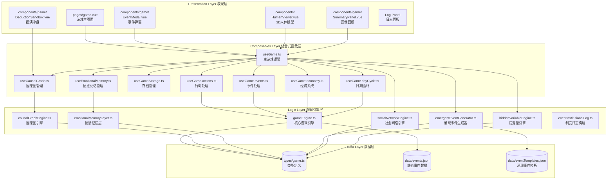

## 3. CEE 核心模块架构

### 3.1 五大 CEE 模块概览

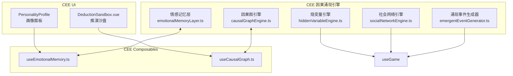

### 3.2 数据流架构

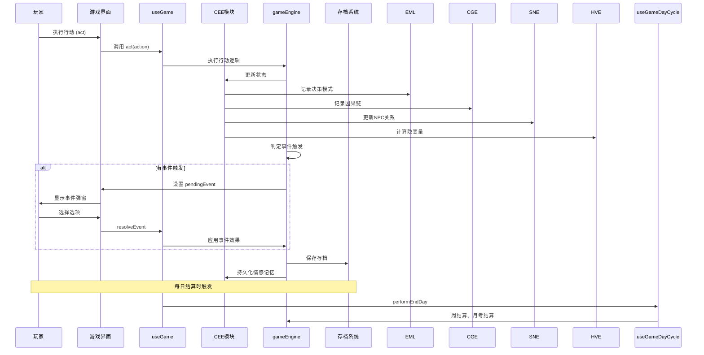

## 4. 游戏主循环

### 4.1 行动执行流程

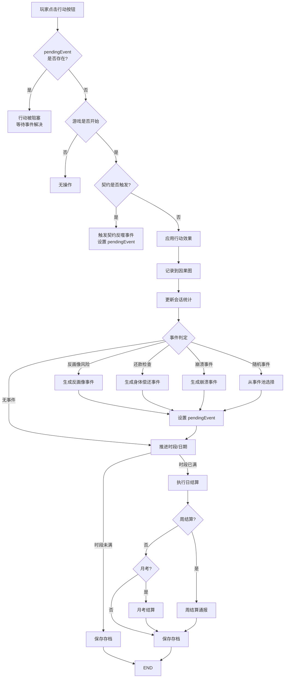

### 4.2 推演沙盘执行序列流程

```mermaid
flowchart TD
    START[点击推演按钮] --> OPEN[打开推演沙盘]
    OPEN --> ADD_ACTION[添加行动到序列]
    ADD_ACTION --> PREDICT[实时预测结果]
    PREDICT -->|显示| STATE_CHANGE[状态变化预览]
    PREDICT -->|显示| RISK[风险提示]
    PREDICT -->|显示| POTENTIAL_EVENTS[可能触发事件]

    ADD_ACTION --> DECISION{继续添加?}
    DECISION -->|是| ADD_ACTION
    DECISION -->|否| COMMIT_OR_CANCEL[确认/取消]

    COMMIT_OR_CANCEL -->|取消| CLOSE[关闭沙盘]
    COMMIT_OR_CANCEL -->|执行序列| LOOP_START[循环执行行动]

    LOOP_START --> NEXT_ACTION[取下一个行动]
    NEXT_ACTION --> CALL_ACT[调用 act]
    CALL_ACT --> CHECK_EVENT{事件触发?}

    CHECK_EVENT -->|是| SET_PENDING[设置 pendingEvent]
    SET_PENDING --> LOOP_END[循环结束]
    CHECK_EVENT -->|否| NEXT[处理下一个行动]

    NEXT -->|还有行动| NEXT_ACTION
    NEXT -->|行动完成| LOOP_END

    LOOP_END --> CLOSE

    Note over SET_PENDING: pendingEvent 存在时<br>后续 act() 调用直接返回<br>序列被中断
```

## 5. CEE 模块详解

### 5.1 情感记忆层 (Emotional Memory Layer)

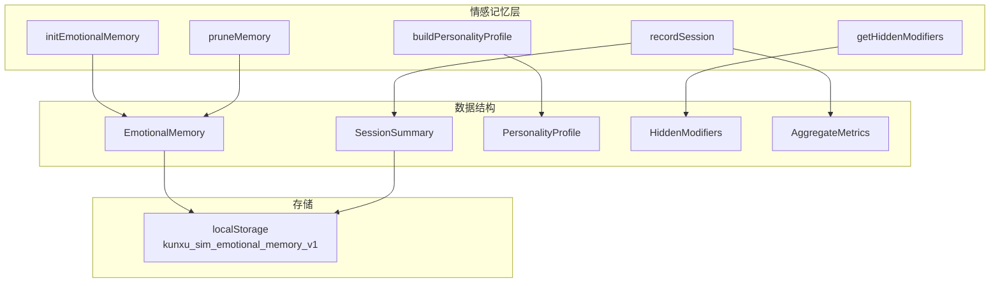

**核心函数**:

| 函数 | 职责 |
|------|------|
| `initEmotionalMemory()` | 初始化或从存储加载情感记忆 |
| `recordSession()` | 记录一次游戏会话摘要 |
| `buildPersonalityProfile()` | 从历史会话构建玩家画像 |
| `getHiddenModifiers()` | 根据画像生成隐变量修饰符 |
| `pruneMemory()` | 超过上限时剪枝旧会话 |

**人格画像类型**:

```typescript
interface PersonalityProfile {
  riskTolerance: 'conservative' | 'moderate' | 'aggressive'
  complianceTendency: 'resistant' | 'adaptive' | 'compliant'
  resourceStrategy: 'accumulator' | 'balanced' | 'spender'
  bodyAutonomyValue: 'high' | 'medium' | 'low'
  stressResponse: 'fighter' | 'negotiator' | 'avoider'
}
```

### 5.2 因果图引擎 (Causal Graph Engine)

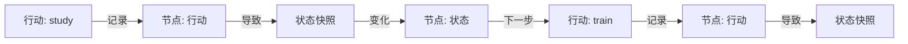

**核心函数**:

| 函数 | 职责 |
|------|------|
| `createCausalGraph()` | 创建空因果图 |
| `recordAction()` | 记录行动及其效果 |
| `predictSequence()` | 预测行动序列结果 |
| `pruneGraph()` | 剪枝以维持性能 |

**预测结果结构**:

```typescript
interface PredictionResult {
  finalState: StateSnapshot      // 最终状态
  stateChain: StateSnapshot[]    // 状态链
  uncertaintyIntervals: Record<string, [number, number]>  // 不确定性区间
  riskIndicators: RiskIndicator[] // 风险提示
  potentialEvents: string[]       // 可能触发的事件
}
```

### 5.3 涌现事件生成器 (Emergent Event Generator)

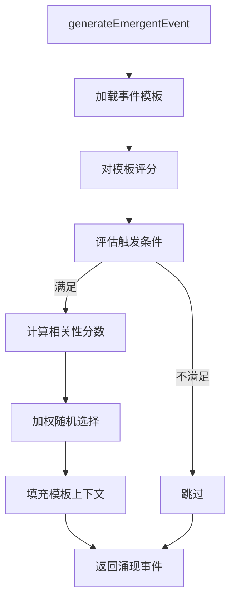

**模板匹配流程**:

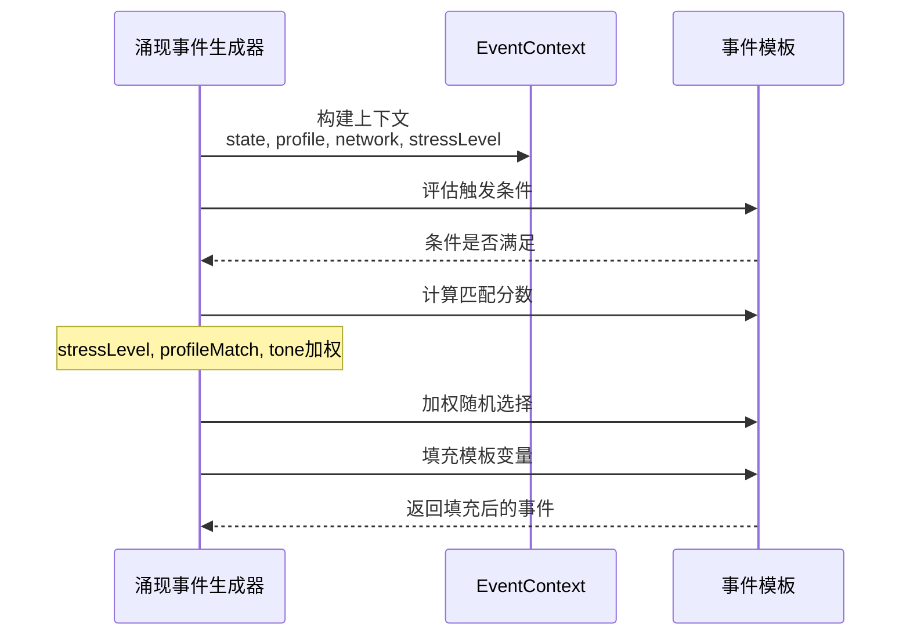

### 5.4 社会网络引擎 (Social Network Engine)

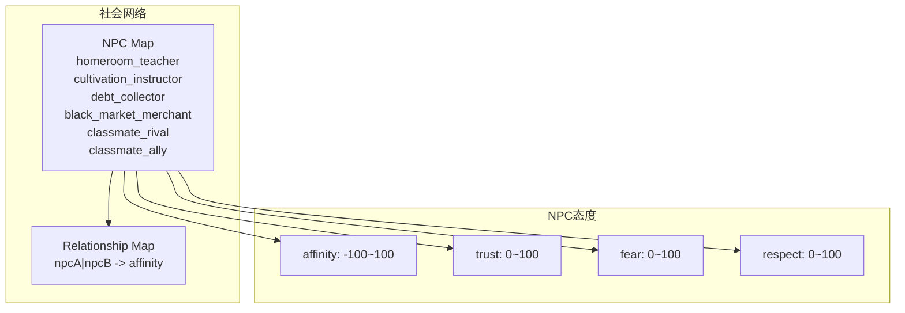

**交互类型与态度变化**:

| 交互类型 | affinity变化 | trust变化 | fear变化 | respect变化 |
|---------|-------------|----------|----------|-------------|
| helped | +20 | +10 | 0 | +15 |
| harmed | -25 | -15 | +10 | -20 |
| ignored | -5 | -5 | 0 | 0 |
| betrayed | -30 | -25 | +15 | -25 |
| impressed | +15 | +20 | -5 | +25 |
| disappointed | -15 | -20 | +5 | -15 |

### 5.5 隐变量引擎 (Hidden Variable Engine)

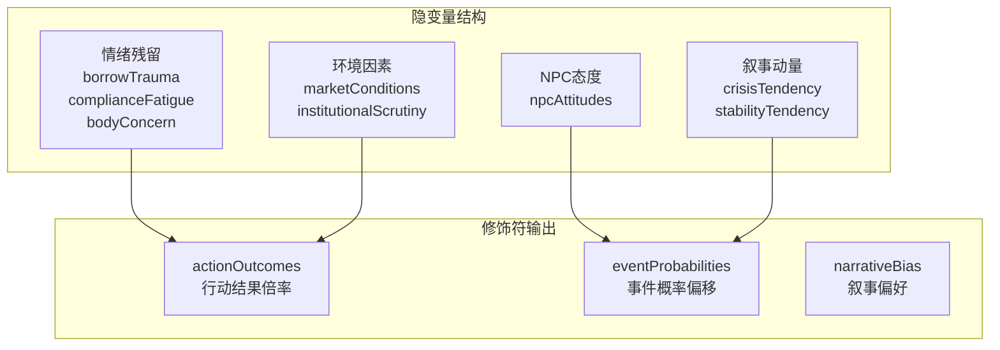

## 6. 行动系统

### 6.1 行动类型与效果

| 行动ID | 名称 | 主要效果 | 副作用 |
|--------|------|---------|--------|
| study | 上课/刷题 | 法力+，道心+ | 疲劳+，专注+ |
| tuna | 吐纳 | 法力+ | 疲劳+ |
| train | 炼体 | 肉体强度+ | 高疲劳，专注- |
| parttime | 打工 | 现金+ | 高疲劳，专注- |
| buy | 购买补给 | 疲劳-，专注+ | 现金- |
| rest | 休息 | 疲劳大幅-，专注+ | 无 |
| borrow | 借贷 | 现金+，债务+ | 无 |
| repay | 还款 | 债务- | 现金- |

### 6.2 行动执行流程图

```mermaid
flowchart TD
    START[act(action)] --> CHECK{started && !pendingEvent}
    CHECK -->|否| END_RTN[直接返回]
    CHECK -->|是| RECORD[记录快照]
    RECORD --> SLOT[当前时段]

    SUBGRAPH "契约反噬检查"
        A[contractWouldTrigger?] -->|是| B[设置 pendingEvent<br>makeContractBacklashEvent]
        B --> END_RTN
    END

    A -->|否| APPLY[应用行动效果]
    APPLY --> STUDY{action === ?}
    STUDY -->|study| STUDY_FN[applyStudyAction]
    STUDY -->|tuna| TUNA_FN[applyTunaAction]
    STUDY -->|train| TRAIN_FN[applyTrainAction]
    STUDY -->|parttime| PART_FN[applyParttimeAction]
    STUDY -->|buy| BUY_FN[applyBuyAction]
    STUDY -->|rest| REST_FN[applyRestAction]

    REST_FN --> LOG[添加日志]
    STUDY_FN --> LOG
    TUNA_FN --> LOG
    TRAIN_FN --> LOG
    PART_FN --> LOG
    BUY_FN --> LOG

    LOG --> ANTI[更新反画像连续]
    ANTI --> METRICS[更新会话统计]
    METRICS --> GRAPH[记录因果图]
    GRAPH --> EVENT[事件判定]

    SUBGRAPH "事件判定"
        EVENT --> ANTI_CHECK{shouldTriggerAntiProfile?}
        ANTI_CHECK -->|是| ANTI_EVT[buildAntiProfileRiskEvent]
        ANTI_CHECK -->|否| REPAY_CHECK{shouldTriggerRepayment?}
        REPAY_CHECK -->|是| REPAY_EVT[buildRepaymentEvent]
        REPAY_CHECK -->|否| ENDING_CHECK{shouldTriggerEnding?}
        ENDING_CHECK -->|是| ENDING_EVT[makeNarrativeEndingEvent]
        ENDING_CHECK -->|否| COLLAPSE[tryEmitStrongCollapse]
        COLLAPSE -->|echo| ECHO_LOG[添加日志]
        COLLAPSE -->|full| COLLAPSE_EVT[设置 pendingEvent]
        COLLAPSE -->|null| RANDOM[r随机事件池]
    END

    RANDOM --> SLOT_MOVE
    ECHO_LOG --> SLOT_MOVE
    COLLAPSE_EVT --> SLOT_MOVE
    ENDING_EVT --> SLOT_MOVE
    REPAY_EVT --> SLOT_MOVE
    ANTI_EVT --> SLOT_MOVE

    SLOT_MOVE --> ADV[推进时段]
    ADV -->|时段已满| DAY_END[执行日结算]
    ADV -->|未满| SAVE[保存存档]
    DAY_END --> SAVE
    SAVE --> END
```

## 7. 经济系统

### 7.1 债务结构

```
总债务 = 系统费用池(collectionFee)
        + 债务本金(debtPrincipal)
        + 应计利息(debtInterestAccrued)
```

### 7.2 利率体系

| 班级 | 日利率 | 最低周还款倍数 | 催收权重 |
|------|--------|---------------|---------|
| 示范班 | 0.94倍基准 | 0.93倍 | 0.86倍 |
| 普通班 | 基准(0.008) | 1.0倍 | 1.0倍 |
| 末位班 | 1.08倍基准 | 1.09倍 | 1.18倍 |

### 7.3 逾期等级制度

| 等级 | 触发条件 | 利率上浮 | 最低周还倍数 |
|------|---------|---------|-------------|
| 0 | 正常 | 1.0倍 | 1.0倍 |
| 1 | 逾期≥14天 | 1.0倍 | 1.0倍 |
| 2 | 逾期≥21天 | 1.12倍 | 1.08倍 |
| 3 | 逾期≥28天 | 1.18倍 | 1.16倍 |
| 4 | 逾期≥35天 | 1.24倍 | 1.24倍 |
| 5 | 逾期≥42天 | 1.30倍 | 1.35倍 |

## 8. 心理系统

### 8.1 契约系统

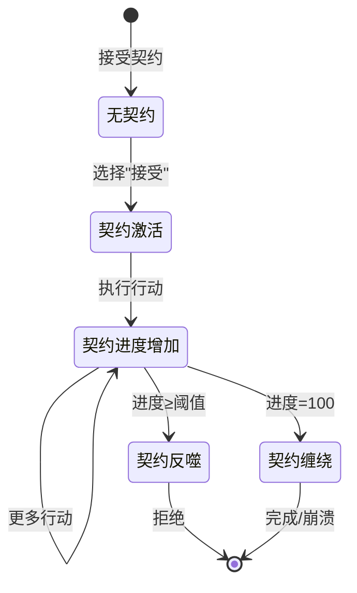

### 8.2 驯化值与麻木化

| 阶段 | 条件 | 效果 |
|------|------|------|
| 觉醒期 | 疲劳<50 | 正常游戏 |
| 适应期 | 疲劳50-70 | 效率略降 |
| 麻木期 | 疲劳>70 | 行动效果递减 |
| 崩溃期 | 特定事件触发 | 严重负面效果 |

## 9. 存档系统

### 9.1 localStorage 结构

| Key | 用途 |
|-----|------|
| `kunxu_sim_save_v2` | 主存档(Autosave) |
| `kunxu_sim_slots` | 存档槽位 |
| `kunxu_sim_emotional_memory_v1` | 情感记忆 |
| `kunxu_sim_causal_graph_v1` | 因果图(可选) |
| `kunxu_sim_social_network_v1` | 社会网络状态 |

### 9.2 存档数据结构

```typescript
interface SaveSlot {
  id: SaveSlotId
  meta: {
    name: string
    createdAt: number
    playedAt: number
    day: number
    debt: number
  } | null
  data: GameState | null
}
```

## 10. 事件系统

### 10.1 事件分类

| 类别 | 说明 | 示例 |
|------|------|------|
| collection | 催收类 | 催收提醒、逾期警告 |
| institutional | 制度类 | 制度抽检、周结算 |
| collapse | 崩溃类 | 精神崩溃、身体崩溃 |
| social | 社交类 | 同学互动、师徒关系 |
| critical | 关键类 | 身体抵押、契约达成 |
| debt | 债务类 | 还款提示、债务重组 |

### 10.2 事件触发流程

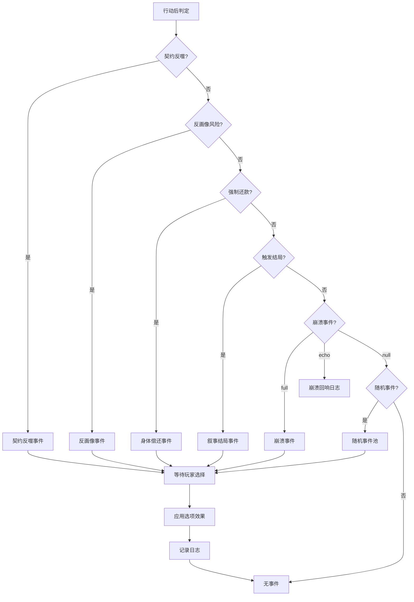

## 11. 文件结构

### 11.1 完整目录树

```
/workspace/
├── app/
│   ├── app.vue                    # 根组件 (AppShell)
│   ├── assets/
│   │   └── css/
│   │       └── main.css           # 全局样式 (CSS Variables)
│   ├── components/
│   │   ├── game/
│   │   │   ├── BorrowModal.vue          # 借贷弹窗
│   │   │   ├── DebtDashboard.vue        # 债务仪表盘
│   │   │   ├── DeductionSandbox.vue     # 推演沙盘 (CEE)
│   │   │   ├── EventModal.vue           # 事件弹窗
│   │   │   ├── HumanModelViewer.vue     # 3D人体模型查看器
│   │   │   ├── LogDrawer.vue            # 日志抽屉 (移动端)
│   │   │   ├── LogPanel.vue             # 日志面板
│   │   │   ├── MobileActionGrid.vue     # 移动端行动网格
│   │   │   ├── MobileToolbar.vue        # 移动端工具栏
│   │   │   ├── RepayModal.vue           # 还款弹窗
│   │   │   ├── RepaymentInfoPanel.vue   # 还款信息面板
│   │   │   ├── StatPanel.vue            # 属性状态面板
│   │   │   ├── SummaryPanel.vue          # 画像面板 (CEE)
│   │   │   └── TutorialModal.vue        # 教程弹窗
│   │   ├── home/
│   │   │   ├── HeroSection.vue          # 英雄区域 (首页)
│   │   │   ├── IdentitySelector.vue     # 身份选择器
│   │   │   ├── ParticleBackground.vue   # 粒子背景
│   │   │   ├── QuickStartButton.vue     # 快速开始按钮
│   │   │   ├── SaveSlotCard.vue        # 存档槽卡片
│   │   │   └── SaveSlotList.vue        # 存档列表
│   │   ├── share/
│   │   │   ├── FateCard.vue            # 命运卡片 (分享)
│   │   │   └── FateCardGenerator.vue   # 命运卡片生成器
│   │   ├── ui/
│   │   │   ├── Button.vue               # 按钮组件
│   │   │   ├── Card.vue                 # 卡片组件
│   │   │   ├── Pill.vue                 # 标签组件
│   │   │   └── ProgressBar.vue          # 进度条组件
│   │   └── HumanViewer.vue              # 3D人体模型 (旧版)
│   ├── composables/
│   │   ├── useGame.ts                  # 主游戏逻辑入口
│   │   ├── useGame.actions.ts           # 行动处理 (applyStudyAction等)
│   │   ├── useGame.class.spec.ts        # 分班制度测试
│   │   ├── useGame.class.ts             # 分班相关逻辑
│   │   ├── useGame.conflict.spec.ts     # 冲突系统测试
│   │   ├── useGame.dayCycle.ts          # 日期循环 (日结算/周结算/月考)
│   │   ├── useGame.debt.spec.ts         # 债务系统测试
│   │   ├── useGame.economy.ts           # 经济系统 (splitDebt/weeklyFee/还款)
│   │   ├── useGame.eventModal.spec.ts   # 事件弹窗测试
│   │   ├── useGame.events.spec.ts       # 事件系统测试
│   │   ├── useGame.events.ts            # 事件构建 (buildRepaymentEvent)
│   │   ├── useGame.feedback.spec.ts     # 反馈系统测试
│   │   ├── useGame.loop.spec.ts         # 游戏循环测试
│   │   ├── useGame.psy.spec.ts         # 心理系统测试
│   │   ├── useGame.spec.ts              # 主逻辑测试
│   │   ├── useGameState.ts              # 游戏状态管理 (defaultState)
│   │   ├── useGameStorage.helpers.ts    # 存档辅助函数
│   │   ├── useGameStorage.spec.ts       # 存档系统测试
│   │   ├── useGameStorage.ts            # 存档管理 (localStorage)
│   │   ├── useGameTutorial.ts           # 教程系统 (driver.js)
│   │   ├── useCausalGraph.ts            # 因果图管理 (CEE)
│   │   ├── useEmotionalMemory.ts        # 情感记忆管理 (CEE)
│   │   └── useShare.ts                  # 分享系统 (命运卡片/剪贴板)
│   ├── logic/
│   │   ├── gameEngine.ts                # 核心引擎 (纯函数, 1200+行)
│   │   ├── gameEngine.antiProfile.spec.ts # 反画像测试
│   │   ├── gameEngine.events.spec.ts     # 引擎事件测试
│   │   ├── gameEngine.profile.spec.ts    # 画像测试
│   │   ├── gameEngine.psy.spec.ts        # 心理计算测试
│   │   ├── causalGraphEngine.ts          # 因果图引擎 (CEE)
│   │   ├── causalGraphEngine.spec.ts     # 因果图测试
│   │   ├── emergentEventGenerator.ts     # 涌现事件生成器 (CEE)
│   │   ├── emergentEventGenerator.spec.ts # 涌现事件测试
│   │   ├── emotionalMemoryLayer.ts      # 情感记忆层 (CEE)
│   │   ├── emotionalMemoryLayer.spec.ts  # 情感记忆测试
│   │   ├── socialNetworkEngine.ts        # 社会网络引擎 (CEE)
│   │   ├── socialNetworkEngine.spec.ts   # 社会网络测试
│   │   ├── hiddenVariableEngine.ts      # 隐变量引擎 (CEE)
│   │   ├── hiddenVariableEngine.spec.ts  # 隐变量测试
│   │   └── eventInstitutionalLog.ts     # 制度日志构建
│   ├── pages/
│   │   ├── index.vue                   # 首页 (开始游戏)
│   │   ├── game.vue                    # 游戏页面 (主界面)
│   │   └── dev/
│   │       ├── body.vue                # 身体模型测试页
│   │       ├── button-test.vue         # 按钮组件测试页
│   │       ├── css-test.vue            # CSS样式测试页
│   │       ├── event-lab.vue           # 事件实验室 (事件调试)
│   │       └── model-test.vue          # 3D模型测试页
│   ├── types/
│   │   └── game.ts                     # 核心类型定义 (680行)
│   └── utils/
│       ├── events.ts                   # 事件工具 (ALL_EVENTS/getEventsByPhase)
│       └── rng.ts                      # 随机数生成 (mulberry32/clamp/uid)
├── data/
│   ├── events.json                     # 静态事件数据 (50+事件)
│   └── eventTemplates.json             # 涌现事件模板 (CEE)
├── docs/
│   └── 事件创作指南.md                  # 事件创作指南 (非开发者)
├── types/
│   └── events.ts                       # 旧版事件类型定义
├── scripts/
│   └── validate-events.mjs              # 事件数据验证脚本
├── .monkeycode/
│   ├── docs/                          # 项目文档
│   ├── specs/                        # 需求/设计规格
│   └── MEMORY.md                     # 用户指令记忆
├── nuxt.config.ts                    # Nuxt配置
├── package.json                      # 依赖配置
├── vitest.config.ts                  # Vitest测试配置
├── tsconfig.json                    # TypeScript配置
└── vercel.json                      # Vercel部署配置
```

### 11.2 组件功能速查表

#### game/ 游戏组件

| 组件 | 文件 | 功能说明 |
|------|------|---------|
| BorrowModal | 借贷弹窗 | 玩家借贷操作界面，显示日利率、信用额度 |
| DebtDashboard | 债务仪表盘 | 展示总债务、分项债务、还款进度 |
| DeductionSandbox | 推演沙盘 | CEE预测界面，序列执行、状态预览、风险提示 |
| EventModal | 事件弹窗 | 事件展示与选项选择，支持强制事件 |
| HumanModelViewer | 人体模型 | Three.js 3D人体模型，身体部位可视化 |
| LogDrawer | 日志抽屉 | 移动端侧滑日志面板 |
| LogPanel | 日志面板 | 桌面端日志列表，支持滚动加载 |
| MobileActionGrid | 移动端行动 | 移动端行动按钮网格布局 |
| MobileToolbar | 移动端工具栏 | 移动端快捷操作栏 |
| RepayModal | 还款弹窗 | 还款操作界面，显示还款选项 |
| RepaymentInfoPanel | 还款信息 | 展示累计还款、可还金额、现金 |
| StatPanel | 状态面板 | 玩家属性展示：道心、法力、肉体、疲劳、专注 |
| SummaryPanel | 画像面板 | CEE画像展示，财务风险、教育信用、制度顺从、身体资产 |
| TutorialModal | 教程弹窗 | 新手引导，使用driver.js |

#### home/ 首页组件

| 组件 | 文件 | 功能说明 |
|------|------|---------|
| HeroSection | 英雄区域 | 游戏标题、副标题、氛围展示 |
| IdentitySelector | 身份选择器 | 贫民/中产/富户三选一，横向滑动卡片 |
| ParticleBackground | 粒子背景 | Canvas粒子动画，营造氛围 |
| QuickStartButton | 快速开始 | 一键开始新游戏 |
| SaveSlotCard | 存档槽卡片 | 单个存档槽展示（日期、班级、债务） |
| SaveSlotList | 存档列表 | 四个存档槽：autosave/slot1/slot2/slot3 |

#### share/ 分享组件

| 组件 | 文件 | 功能说明 |
|------|------|---------|
| FateCard | 命运卡片 | 视觉化命运档案卡片，支持截图分享 |
| FateCardGenerator | 命运卡片生成器 | 计算命运标签、生成卡片数据 |

#### ui/ 基础UI组件

| 组件 | 文件 | 功能说明 |
|------|------|---------|
| Button | 按钮 | variants: primary/secondary/ghost/danger, sizes: sm/md |
| Card | 卡片 | 通用卡片容器，支持padding配置 |
| Pill | 标签 | 徽章式标签，variants: default/warning/success |
| ProgressBar | 进度条 | 条形进度指示器 |

### 11.3 Composables 功能速查表

| Composable | 文件 | 导出函数/值 |
|------------|------|-------------|
| useGame | useGame.ts | game, act, borrow, repay, resolveEvent, startNew, saveToSlot, loadFromSlot |
| useGameState | useGameState.ts | defaultState, game |
| useGameActions | useGame.actions.ts | applyStudyAction, applyTunaAction, applyTrainAction, applyParttimeAction, applyBuyAction, applyRestAction |
| useGameEvents | useGame.events.ts | buildRepaymentEvent, executeBodyPartRepayment |
| useGameEconomy | useGame.economy.ts | splitInitialDebtForGame, weeklySystemFee, applyWeeklyCollectionFee, applyRepaymentByPriority, executeImmediatePayment |
| useGameDayCycle | useGame.dayCycle.ts | finalizeDayRouteStreak, applyNarrativeDelays, applyWeeklyExam, applyDelinquencyCheck, endDay |
| useGameStorage | useGameStorage.ts | saveToSlot, loadFromSlot, listSlots, reset |
| useGameTutorial | useGameTutorial.ts | start, finish, reset, isActive, isCompleted |
| useCausalGraph | useCausalGraph.ts | causalGraph, recordGameAction, predictActions, executeSandboxSequence, openSandbox |
| useEmotionalMemory | useEmotionalMemory.ts | memory, getProfile, getModifiers, recordGameSession, initialize, exportMemory, importMemory |
| useShare | useShare.ts | shareText, generateShareContent, shareToClipboard, nativeShare |

### 11.4 Logic 层函数速查表

| 模块 | 文件 | 核心函数 |
|------|------|---------|
| gameEngine | gameEngine.ts | scoreForExam, determineTier, calculateWeeklyMinPayment, shouldTriggerAntiProfileRiskEvent, buildAntiProfileRiskEvent, tryEmitStrongCollapse, buildSocialProfile |
| causalGraphEngine | causalGraphEngine.ts | createCausalGraph, recordAction, predictSequence, pruneGraph |
| emergentEventGenerator | emergentEventGenerator.ts | generateEmergentEvent, scoreTemplateRelevance, fillTemplate |
| emotionalMemoryLayer | emotionalMemoryLayer.ts | initEmotionalMemory, recordSession, buildPersonalityProfile, getHiddenModifiers, pruneMemory |
| socialNetworkEngine | socialNetworkEngine.ts | createSocialNetwork, recordInteraction, propagateInfluence, checkThresholdEvents |
| hiddenVariableEngine | hiddenVariableEngine.ts | updateHiddenVariables, applyActionModifier, applyEventProbabilityModifier, buildModifiersFromProfile |
| eventInstitutionalLog | eventInstitutionalLog.ts | buildInstitutionalEventLogDetail |

### 11.5 数据文件格式

#### data/events.json 事件数据

```typescript
interface EventDefinition {
  id: string                    // 唯一ID
  title: string                 // 标题
  body: string                  // 正文
  type: 'collection' | 'teacher' | 'school' | 'ritual' | 'random' // 事件类型
  tone: 'info' | 'warn' | 'danger' | 'ok'  // 情绪色调
  phase?: 'afterAction'        // 触发阶段
  weight?: number               // 权重
  cooldownDays?: number         // 冷却天数
  maxTimes?: number            // 最大触发次数
  trigger?: EventTrigger        // 触发条件
  options: EventOption[]        // 选项列表
}
```

#### data/eventTemplates.json 涌现事件模板

```typescript
interface EventTemplate {
  id: string
  family: string
  phase: EventPhase
  triggerConditions: TemplateCondition[]
  titleTemplate: string
  bodyTemplate: string
  optionTemplates: OptionTemplate[]
  weight: number
  tone: EventTone
  tier?: 'critical' | 'normal'
}
```

### 11.6 工具函数

| 函数 | 文件 | 功能 |
|------|------|------|
| mulberry32 | rng.ts | 确定性随机数生成器 (seeded PRNG) |
| clamp | rng.ts | 数值限制在[min, max]范围 |
| round1 | rng.ts | 四舍五入到一位小数 |
| uid | rng.ts | 生成唯一ID字符串 |
| ALL_EVENTS | events.ts | 所有静态事件列表 |
| getEventsByPhase | events.ts | 按阶段筛选事件 |
| getCollapseEventDeck | events.ts | 获取崩溃事件卡组 |
app/
├── components/
│   ├── game/
│   │   ├── DeductionSandbox.vue    # 推演沙盘
│   │   ├── EventModal.vue          # 事件弹窗
│   │   ├── SummaryPanel.vue        # 画像面板
│   │   └── MobileToolbar.vue       # 移动端工具栏
│   └── HumanViewer.vue             # 3D人体模型
├── composables/
│   ├── useGame.ts                  # 主游戏逻辑入口
│   ├── useGame.actions.ts          # 行动处理
│   ├── useGame.events.ts           # 事件构建
│   ├── useGame.economy.ts          # 经济系统
│   ├── useGame.dayCycle.ts         # 日期循环
│   ├── useGameStorage.ts           # 存档管理
│   ├── useCausalGraph.ts           # 因果图管理
│   └── useEmotionalMemory.ts       # 情感记忆管理
├── logic/
│   ├── gameEngine.ts               # 核心引擎(纯函数)
│   ├── causalGraphEngine.ts        # 因果图引擎
│   ├── emotionalMemoryLayer.ts     # 情感记忆层
│   ├── emergentEventGenerator.ts    # 涌现事件生成器
│   ├── socialNetworkEngine.ts      # 社会网络引擎
│   ├── hiddenVariableEngine.ts     # 隐变量引擎
│   └── eventInstitutionalLog.ts    # 制度日志构建
├── pages/
│   ├── index.vue                   # 首页
│   ├── game.vue                    # 游戏页面
│   └── dev/
│       └── event-lab.vue           # 事件实验室
├── types/
│   └── game.ts                     # 核心类型定义
├── utils/
│   ├── events.ts                   # 事件工具
│   └── rng.ts                      # 随机数生成
data/
├── events.json                     # 静态事件数据
└── eventTemplates.json             # 涌现事件模板
```

## 12. 测试覆盖

| 模块 | 测试文件 | 测试数 |
|------|---------|-------|
| useGame | useGame.spec.ts | 40+ |
| 行动系统 | useGame.actions.spec.ts | 15+ |
| 债务系统 | useGame.debt.spec.ts | 20+ |
| 分班制度 | useGame.class.spec.ts | 15+ |
| 游戏循环 | useGame.loop.spec.ts | 10+ |
| 事件系统 | useGame.events.spec.ts | 20+ |
| 心理系统 | useGame.psy.spec.ts | 30+ |
| 冲突系统 | useGame.conflict.spec.ts | 15+ |
| 反馈系统 | useGame.feedback.spec.ts | 10+ |
| 事件弹窗 | useGame.eventModal.spec.ts | 15+ |
| 存档系统 | useGameStorage.spec.ts | 20+ |
| gameEngine | gameEngine.psy.spec.ts | 25+ |
| gameEngine | gameEngine.events.spec.ts | 20+ |
| gameEngine | gameEngine.profile.spec.ts | 20+ |
| gameEngine | gameEngine.antiProfile.spec.ts | 20+ |
| causalGraph | causalGraphEngine.spec.ts | 30+ |
| emotionalMemory | emotionalMemoryLayer.spec.ts | 30+ |
| emergentEvent | emergentEventGenerator.spec.ts | 25+ |
| socialNetwork | socialNetworkEngine.spec.ts | 20+ |
| hiddenVariable | hiddenVariableEngine.spec.ts | 20+ |

**总测试数**: 400+ 测试用例

## 13. CEE 模块集成点

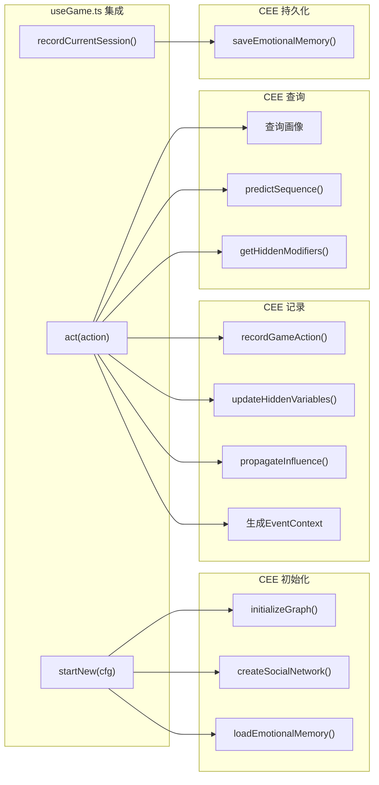

## 14. 根组件与路由

### 14.1 app.vue 结构

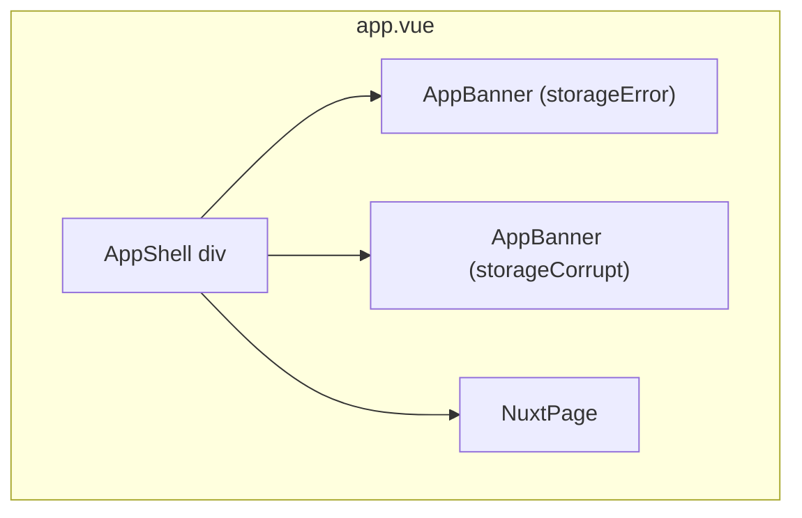

### 14.2 页面路由

| 路径 | 页面 | 功能 |
|------|------|------|
| `/` | pages/index.vue | 首页：身份选择、开始游戏、存档管理 |
| `/game` | pages/game.vue | 游戏主页面 |
| `/dev/body` | pages/dev/body.vue | 身体模型测试 |
| `/dev/button-test` | pages/dev/button-test.vue | 按钮组件测试 |
| `/dev/css-test` | pages/dev/css-test.vue | CSS样式测试 |
| `/dev/event-lab` | pages/dev/event-lab.vue | 事件实验室 |
| `/dev/model-test` | pages/dev/model-test.vue | 3D模型测试 |

### 14.3 游戏页面布局

```
pages/game.vue
├── AppShell
│   ├── AppBanner (存档错误提示)
│   └── NuxtPage
│       └── GamePage
│           ├── 顶部导航栏
│           │   ├── 返回首页
│           │   ├── 推演沙盘按钮
│           │   └── 存档信息
│           ├── 状态面板 (StatPanel)
│           │   ├── 道心/法力/肉体/疲劳/专注
│           │   └── 时段指示
│           ├── 债务仪表盘 (DebtDashboard)
│           │   ├── 总债务
│           │   ├── 本金/利息/费用池
│           │   └── 逾期等级
│           ├── 人体模型 (HumanModelViewer)
│           │   └── 身体部位可视化
│           ├── 行动面板 (桌面端)
│           │   ├── 上课/刷题
│           │   ├── 吐纳
│           │   ├── 炼体
│           │   ├── 打工
│           │   ├── 购买补给
│           │   ├── 休息
│           │   ├── 借贷
│           │   └── 还款
│           ├── 移动端工具栏 (MobileToolbar)
│           ├── 日志面板 (LogPanel)
│           ├── 画像面板 (SummaryPanel) - CEE
│           ├── 推演沙盘 (DeductionSandbox) - CEE
│           ├── 事件弹窗 (EventModal)
│           ├── 教程弹窗 (TutorialModal)
│           ├── 移动端日志抽屉 (LogDrawer)
│           └── 移动端行动网格 (MobileActionGrid)
```

## 15. CSS 设计系统

### 15.1 设计令牌 (Design Tokens)

```css
/* 背景色 */
--bg-primary: #000000;      /* 深黑色 - 主背景 */
--bg-secondary: #121212;    /* 暗灰色 - 次级背景 */
--bg-tertiary: #0A0E27;     /* 午夜蓝 - 卡片背景 */

/* 霓虹强调色 */
--neon-green: #00FF00;      /* Matrix 绿 - 成功 */
--neon-magenta: #FF00FF;    /* 品红 - 警告 */
--neon-cyan: #00FFFF;       /* 青色 - 主要强调 */
--neon-blue: #0080FF;       /* 霓虹蓝 - 次要强调 */

/* 功能色 */
--primary: #1E40AF;         /* 主要操作 */
--secondary: #3B82F6;      /* 次要操作 */
--danger: #FF3B3B;         /* 危险/错误 */
--warning: #FFD24A;        /* 警告 */
--ok: #44ff9a;             /* 成功 */

/* 文本色 */
--text-primary: #E8ECF6;    /* 主文本 */
--text-secondary: #9AA6C6;  /* 次要文本 */
--text-muted: #6B7280;      /* 弱化文本 */

/* 边框和发光效果 */
--border-default: rgba(255,255,255,0.10);
--glow-cyan: 0 0 10px rgba(0,255,255,0.5);
--glow-magenta: 0 0 10px rgba(255,0,255,0.5);
--glow-green: 0 0 10px rgba(0,255,0,0.5);
--glow-red: 0 0 10px rgba(255,59,59,0.5);

/* 字体 */
--mono: "IBM Plex Mono", ui-monospace;
--serif: "ZCOOL XiaoWei", ui-serif;

/* 字号 */
--text-xs: 11px;
--text-sm: 12px;
--text-base: 14px;
--text-lg: 16px;
--text-xl: 18px;
--text-2xl: 24px;
--text-3xl: 28px;
```

## 16. GameState 数据结构

```typescript
interface GameState {
  started: boolean                          // 游戏是否已开始
  seed: number                             // 随机种子
  startConfig?: StartConfig                // 初始配置

  // 属性系统
  stats: {
    daoXin: number                         // 道心等级
    faLi: number                           // 法力
    rouTi: number                          // 肉体强度 (0~10)
    fatigue: number                        // 疲劳 (0~100)
    focus: number                          // 专注 (0~100)
  }

  // 经济系统
  econ: {
    cash: number                           // 现金
    collectionFee: number                  // 系统费用池
    debtPrincipal: number                  // 债务本金
    debtInterestAccrued: number            // 应计利息
    dailyRate: number                      // 日利率
    delinquency: number                     // 逾期等级 (0-5)
    lastPaymentDay: number                 // 上次还款日
    debtLock?: 'normal' | 'bodyLocked'    // 债务锁定状态
    lockedDebtAmount?: number              // 锁定债务金额
  }

  // 学校系统
  school: {
    day: number                            // 当前天数
    week: number                           // 当前周数
    slot: SlotId                           // 当前时段
    classTier: '示范班' | '普通班' | '末位班'
    lastExamScore: number                  // 上次考试成绩
    lastRank: number                       // 上次排名
    perks: {
      mealSubsidy: number                  // 餐补
      focusBonus: number                   // 专注加成
    }
  }

  // 契约系统
  contract: {
    active: boolean
    name: string
    patron: string
    progress: number                       // 契约缠绕度 (0~100)
    vigilance: number                     // 监工敏感度
    lastTriggerDay: number
    lastTriggerSlot?: SlotId
  }

  // 日志与历史
  logs: LogEntry[]
  eventHistory: Record<string, number>      // 事件触发历史
  familyHistory: Record<string, number>   // 同族事件冷却

  // 身体系统
  bodyPartRepayment?: Record<BodyPartId, boolean>
  bodyIntegrity: number                    // 身体完整度 (0~1)
  bodyReputation: 'clean' | 'marked' | 'mortgaged' | 'depleted'
  buyDebasement: number                   // 购买降级

  // 行动追踪
  daySlotActions?: Record<SlotId, ActionId>
  scoreDayStreak?: number                 // 连续刷分天数
  cashDayStreak?: number                 // 连续打工天数

  // 心理系统
  domestication: number                   // 驯化值
  numbness: number                        // 麻木值

  // CEE 扩展
  causalGraph?: CausalGraph              // 因果图
  socialNetwork?: SocialNetwork           // 社会网络
  sessionMetrics?: SessionMetrics         // 会话统计
  hiddenVariables?: HiddenVariables      // 隐变量
  profileSnapshot?: ProfileSnapshot       // 画像快照

  // 叙事系统
  pendingNarratives?: Array<{ day: number; partId: BodyPartId }>
  summaryUnlocked?: boolean
  summaryUnlockedAtDay?: number
  summarySeen?: boolean
  summarySeenAtDay?: number

  // 崩溃系统
  collapseModifierActive?: boolean
  antiProfileStreak?: number
  lastBodyPartRepaymentDay?: number
  lastBodyPartDay?: number
}
```

## 17. 存档系统

### 17.1 localStorage Key 结构

| Key | 类型 | 用途 |
|-----|------|------|
| `kunxu_sim_save_v2` | GameState | 主存档 (autosave) |
| `kunxu_sim_slots` | SaveSlot[] | 存档槽位元数据 |
| `kunxu_sim_emotional_memory_v1` | EmotionalMemory | CEE情感记忆 |
| `kunxu_sim_causal_graph_v1` | CausalGraph | CEE因果图 (可选) |
| `kunxu_sim_social_network_v1` | SocialNetwork | CEE社会网络 |
| `xiuxian-tutorial-completed` | boolean | 教程完成状态 |

### 17.2 存档槽位

```typescript
type SaveSlotId = 'autosave' | 'slot1' | 'slot2' | 'slot3'

interface SaveSlot {
  id: SaveSlotId
  meta: {
    name: string           // 存档名称
    createdAt: number       // 创建时间
    playedAt: number        // 最后游玩时间
    day: number            // 游戏天数
    tier: string           // 分班
    debt: number           // 债务
    cash: number           // 现金
  } | null
  data: GameState | null   // 游戏状态数据
}
```

## 18. 开发/调试页面

### 18.1 事件实验室 (/dev/event-lab)

用于手动测试和创建新事件：
- 编辑事件JSON
- 预览事件效果
- 复制到 data/events.json

### 18.2 其他开发页面

| 路径 | 功能 |
|------|------|
| `/dev/body` | Three.js人体模型调试 |
| `/dev/button-test` | Button组件 variant/size 测试 |
| `/dev/css-test` | CSS变量和样式测试 |
| `/dev/model-test` | 3D模型渲染测试 |

## 19. 第三方依赖

| 库 | 版本 | 用途 |
|----|------|------|
| Nuxt | 4.3.1 | Vue框架 |
| Vue | 3.5.30 | 响应式UI |
| Three.js | 0.183.2 | 3D图形 |
| driver.js | - | 新手引导 |
| Vitest | 4.1.0 | 单元测试 |
