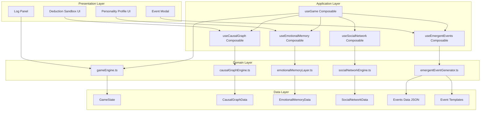
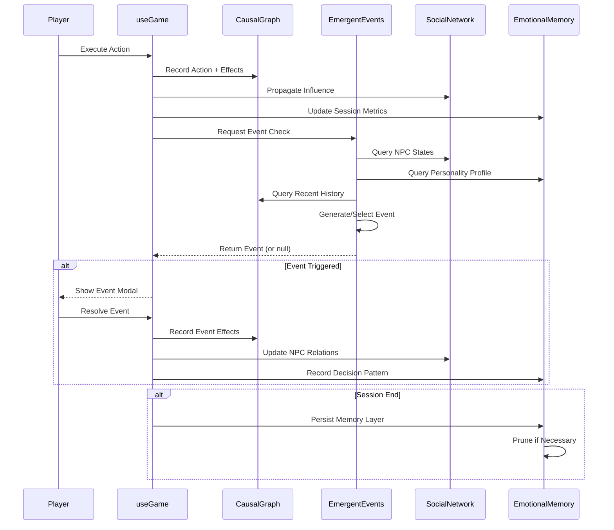

# Causal Emergence Engine (CEE) Design Document

Feature Name: causal-emergence-engine
Updated: 2026-04-26

## Description

The Causal Emergence Engine is a foundational architectural upgrade that transforms "修仙欠费中" from a linear action-result simulator into a deep psychological-economic emergent system. It introduces four interconnected subsystems:

1. **Emotional Memory Layer (EML)**: Cross-session persistence of player decision patterns
2. **Causal Graph Engine**: Directed acyclic graph for action-state relationships and prediction
3. **Emergent Event System**: Dynamic event generation based on world state and player profile
4. **NPC Social Network**: Hidden relationship graph with influence propagation

These systems work together to create unique, deeply personal gameplay experiences where every choice leaves traces that echo across sessions.

## Architecture



### Data Flow



## Components and Interfaces

### 1. Emotional Memory Layer (`emotionalMemoryLayer.ts`)

**Responsibility**: Persist and analyze player decision patterns across sessions.

**Key Functions**:

```typescript
// Initialize or load emotional memory from storage
function initEmotionalMemory(): EmotionalMemory

// Record a session summary when game ends
function recordSession(memory: EmotionalMemory, session: SessionSummary): EmotionalMemory

// Calculate personality profile from memory history
function buildPersonalityProfile(memory: EmotionalMemory): PersonalityProfile

// Apply memory influence to new game state
function applyMemoryToState(memory: EmotionalMemory, state: GameState): GameState

// Get hidden variable modifiers based on profile
function getHiddenModifiers(profile: PersonalityProfile): HiddenModifiers

// Prune old sessions if limit exceeded
function pruneMemory(memory: EmotionalMemory, maxSessions: number): EmotionalMemory
```

**Data Structures**:

```typescript
interface EmotionalMemory {
  version: number
  sessions: SessionSummary[]
  aggregateMetrics: AggregateMetrics
  lastUpdated: number
}

interface SessionSummary {
  id: string
  startDay: number
  endDay: number
  totalDays: number
  actionCounts: Record<ActionId, number>
  borrowCount: number
  bodyPartRepaymentCount: number
  contractAccepted: boolean
  contractFinalProgress: number
  finalTier: string
  finalDebt: number
  finalCash: number
  antiProfileStreakMax: number
  routePreference: 'score' | 'cash' | 'mixed'
  timestamp: number
}

interface PersonalityProfile {
  riskTolerance: 'conservative' | 'moderate' | 'aggressive'
  complianceTendency: 'resistant' | 'adaptive' | 'compliant'
  resourceStrategy: 'accumulator' | 'balanced' | 'spender'
  bodyAutonomyValue: 'high' | 'medium' | 'low'
  stressResponse: 'fighter' | 'negotiator' | 'avoider'
  dominantTraits: string[]
}

interface HiddenModifiers {
  actionOutcomes: Record<string, number>  // multipliers
  eventProbabilities: Record<string, number>  // relative shifts
  narrativeBias: string[]  // template categories to prefer
}
```

### 2. Causal Graph Engine (`causalGraphEngine.ts`)

**Responsibility**: Maintain and query the directed acyclic graph of action-state relationships.

**Key Functions**:

```typescript
// Create empty causal graph
function createCausalGraph(): CausalGraph

// Record an action and its effects
function recordAction(
  graph: CausalGraph,
  action: ActionId,
  beforeState: StateSnapshot,
  afterState: StateSnapshot,
  hiddenContributions?: Record<string, number>
): CausalGraph

// Predict state after a sequence of actions
function predictSequence(
  graph: CausalGraph,
  currentState: GameState,
  actions: ActionId[],
  hiddenModifiers?: HiddenModifiers
): PredictionResult

// Prune old nodes while preserving critical paths
function pruneGraph(graph: CausalGraph, maxNodes: number): CausalGraph

// Get recent causal chain (last N days)
function getRecentChain(graph: CausalGraph, days: number): CausalNode[]
```

**Data Structures**:

```typescript
interface CausalGraph {
  nodes: Map<string, CausalNode>
  edges: CausalEdge[]
  nodeCounter: number
}

interface CausalNode {
  id: string
  type: 'action' | 'state'
  timestamp: number
  day: number
  slot?: SlotId
  data: ActionRecord | StateSnapshot
}

interface CausalEdge {
  from: string
  to: string
  weight: number
  effectType: 'stat' | 'econ' | 'hidden' | 'event'
  hiddenVariable?: string
  day: number
}

interface PredictionResult {
  finalState: StateSnapshot
  stateChain: StateSnapshot[]
  uncertaintyIntervals: Record<string, [number, number]>
  riskIndicators: RiskIndicator[]
  potentialEvents: string[]
}

interface RiskIndicator {
  type: 'debt_trajectory' | 'fatigue_accumulation' | 'exam_forecast' | 'collapse_risk'
  level: 'low' | 'medium' | 'high' | 'critical'
  description: string
}
```

### 3. Emergent Event Generator (`emergentEventGenerator.ts`)

**Responsibility**: Generate unique, contextually appropriate events based on current world state.

**Key Functions**:

```typescript
// Attempt to generate an emergent event
function generateEmergentEvent(
  state: GameState,
  profile: PersonalityProfile,
  network: SocialNetwork,
  recentChain: CausalNode[],
  hiddenModifiers: HiddenModifiers,
  rand: () => number
): EmergentEvent | null

// Fill event template with contextual data
function fillTemplate(
  template: EventTemplate,
  context: EventContext
): FilledEvent

// Score template relevance to current state
function scoreTemplateRelevance(
  template: EventTemplate,
  context: EventContext
): number

// Fallback to static event system
function fallbackToStaticEvent(
  state: GameState,
  phase: EventPhase,
  rand: () => number
): EventDefinition | null
```

**Data Structures**:

```typescript
interface EventTemplate {
  id: string
  family: string
  phase: EventPhase
  triggerConditions: TemplateCondition[]
  titleTemplate: string
  bodyTemplate: string
  optionTemplates: OptionTemplate[]
  weight: number
  tone: EventTone
  tier?: 'critical' | 'normal'
}

interface TemplateCondition {
  variable: string  // e.g., "stats.fatigue", "profile.riskTolerance"
  operator: 'gt' | 'lt' | 'eq' | 'in' | 'contains'
  value: unknown
}

interface OptionTemplate {
  id: string
  labelTemplate: string
  tone: 'normal' | 'danger' | 'primary'
  effectTemplates: EffectTemplate[]
}

interface EffectTemplate {
  kind: EventEffectKind
  targetTemplate: string  // e.g., "stats.${primaryStat}"
  deltaTemplate: string   // e.g., "-${baseValue} * ${stressFactor}"
}

interface EventContext {
  state: GameState
  profile: PersonalityProfile
  network: SocialNetwork
  recentChain: CausalNode[]
  hiddenModifiers: HiddenModifiers
  primaryNPC?: string
  stressLevel: number
}

interface EmergentEvent {
  id: string
  title: string
  body: string
  options: EventOptionDefinition[]
  tone: EventTone
  tier?: 'critical' | 'normal'
  isEmergent: true
  generatedAt: number
}
```

### 4. Social Network Engine (`socialNetworkEngine.ts`)

**Responsibility**: Manage NPC relationships and propagate player influence.

**Key Functions**:

```typescript
// Initialize default social network
function createSocialNetwork(): SocialNetwork

// Record player interaction with NPC
function recordInteraction(
  network: SocialNetwork,
  npcId: string,
  interactionType: InteractionType,
  intensity: number
): SocialNetwork

// Propagate influence through network
function propagateInfluence(
  network: SocialNetwork,
  sourceNpcId: string,
  change: RelationshipChange
): SocialNetwork

// Get NPC attitude toward player
function getNpcAttitude(
  network: SocialNetwork,
  npcId: string
): NpcAttitude

// Check for threshold-crossing events
function checkThresholdEvents(
  network: SocialNetwork,
  state: GameState
): ThresholdEvent[]

// Get visible hints about hidden relationships
function getRelationshipHints(
  network: SocialNetwork,
  playerInsight: number
): RelationshipHint[]
```

**Data Structures**:

```typescript
interface SocialNetwork {
  npcs: Map<string, NPC>
  relationships: Map<string, Relationship>  // key: "npcA|npcB"
  lastPropagated: number
}

interface NPC {
  id: string
  name: string
  role: string
  attitude: NpcAttitude
  memory: NpcMemory[]
  thresholdTriggers: ThresholdTrigger[]
}

interface NpcAttitude {
  affinity: number      // -100 to 100
  trust: number         // 0 to 100
  fear: number          // 0 to 100
  respect: number       // 0 to 100
  hiddenTags: string[]  // e.g., "secret_rival", "indebted"
}

interface Relationship {
  npcA: string
  npcB: string
  affinity: number      // -100 to 100
  sharedSecrets: string[]
  sharedGrievances: string[]
  lastInteraction: number
}

interface NpcMemory {
  day: number
  eventType: string
  impact: number
  description: string
}

interface ThresholdTrigger {
  condition: string
  eventTemplateId: string
  triggered: boolean
}

interface RelationshipHint {
  npcA: string
  npcB: string
  hintType: 'tension' | 'alliance' | 'secret'
  description: string
  confidence: number
}

type InteractionType =
  | 'helped'
  | 'harmed'
  | 'ignored'
  | 'betrayed'
  | 'impressed'
  | 'disappointed'
```

### 5. Deduction Sandbox UI (`DeductionSandbox.vue`)

**Responsibility**: Provide a visual interface for planning and predicting action sequences.

**Key Components**:

- **Timeline View**: Horizontal timeline showing predicted state changes across days
- **Action Queue**: Draggable list of planned actions
- **State Projections**: Numerical displays of predicted stats, economy, and risk indicators
- **Uncertainty Visualization**: Error bars or confidence intervals on predictions
- **Commit/Cancel Controls**: Buttons to execute or discard the planned sequence

**Props**:

```typescript
interface DeductionSandboxProps {
  currentState: GameState
  causalGraph: CausalGraph
  personalityProfile: PersonalityProfile
  hiddenModifiers: HiddenModifiers
}

interface DeductionSandboxEmits {
  (e: 'commit', actions: ActionId[]): void
  (e: 'cancel'): void
}
```

## Data Models

### Integration with Existing GameState

The CEE systems extend the existing `GameState` interface without breaking compatibility:

```typescript
interface GameState {
  // ... existing fields ...

  // CEE extensions
  causalGraph?: CausalGraph
  socialNetwork?: SocialNetwork
  sessionMetrics?: SessionMetrics
  hiddenVariables?: HiddenVariables
}

interface SessionMetrics {
  actionCounts: Record<ActionId, number>
  borrowCount: number
  bodyPartRepaymentCount: number
  antiProfileActionCount: number
  restCount: number
  startTime: number
}

interface HiddenVariables {
  emotionalResidues: Record<string, number>
  environmentalFactors: Record<string, number>
  npcAttitudes: Record<string, number>
  narrativeMomentum: Record<string, number>
}
```

### Persistence Strategy

```
localStorage keys:
- kunxu_sim_save_v2: Existing game save (unchanged)
- kunxu_sim_emotional_memory_v1: Emotional Memory Layer
- kunxu_sim_causal_graph_v1: Causal Graph (optional, can be reconstructed)
- kunxu_sim_social_network_v1: Social Network state
```

## Correctness Properties

1. **Causal Graph Acyclicity**: The Causal Graph must always remain a DAG. Action nodes point to state nodes, state nodes point to subsequent action nodes, but no cycles are permitted.

2. **Hidden Variable Opacity**: Hidden variables must never be directly displayed in the UI. Their effects are visible through outcome variations, but their exact values remain concealed.

3. **Deterministic Simulation**: Given the same seed, initial state, and action sequence, the game must produce identical results. Hidden variables are derived deterministically from the Emotional Memory Layer and session history.

4. **Backward Compatibility**: Existing save files without CEE data must load successfully, with CEE systems initializing to default states.

5. **Performance Bounds**: Causal Graph predictions must complete within 100ms for 21-action sequences. Social Network propagation must complete within 50ms.

## Error Handling

| Scenario | Handling Strategy |
|----------|-------------------|
| localStorage full | Gracefully degrade to in-memory only; warn player that progress won't persist |
| Causal Graph corruption | Rebuild from recent save state; log error for debugging |
| Template matching fails | Fall back to static event system silently |
| Social Network inconsistency | Reset conflicting relationships to neutral; log error |
| Emotional Memory parse error | Reset to empty memory; preserve existing saves |
| Prediction timeout | Return partial prediction with uncertainty flag |

## Test Strategy

### Unit Tests

1. **Emotional Memory Layer**
   - Session recording and aggregation
   - Personality profile calculation
   - Hidden modifier generation
   - Pruning logic

2. **Causal Graph Engine**
   - Graph construction and edge creation
   - Prediction accuracy for known sequences
   - Pruning preserves critical paths
   - DAG validation

3. **Emergent Event Generator**
   - Template matching and scoring
   - Template filling with context
   - Fallback to static events
   - Deterministic generation with same seed

4. **Social Network Engine**
   - Influence propagation accuracy
   - Threshold detection
   - Relationship hint generation

### Integration Tests

1. **End-to-End Session Flow**
   - Start game → execute actions → end session → verify memory persistence
   - Start new game → verify memory influence on initial state

2. **Sandbox Accuracy**
   - Plan sequence in sandbox → execute same sequence manually → compare results
   - Verify uncertainty intervals contain actual outcomes

3. **Event Generation Quality**
   - Trigger emergent events in various states → verify contextual appropriateness
   - Verify fallback behavior when templates don't match

### Performance Tests

1. **Prediction Latency**: Measure time for 21-action sequence predictions
2. **Propagation Latency**: Measure time for Social Network influence propagation
3. **Memory Growth**: Monitor Causal Graph size over long sessions

## Implementation Phases

### Phase 1: Foundation (Week 1-2)
- Implement Emotional Memory Layer data structures and persistence
- Implement basic Causal Graph construction
- Integrate with existing `useGame` composable

### Phase 2: Prediction (Week 3-4)
- Implement Causal Graph prediction engine
- Build Deduction Sandbox UI component
- Add hidden variable system with basic modifiers

### Phase 3: Emergence (Week 5-6)
- Design and implement event template system
- Build Emergent Event Generator
- Create initial template library (20-30 templates)

### Phase 4: Social Network (Week 7-8)
- Implement NPC Social Network data structures
- Build influence propagation system
- Add relationship hint system

### Phase 5: Polish (Week 9-10)
- Integrate all systems into cohesive experience
- Add narrative text variations based on hidden variables
- Balance and tune hidden modifier magnitudes
- Performance optimization

## References

[^1]: (Project) - `app/types/game.ts` - Core GameState interface
[^2]: (Project) - `app/logic/gameEngine.ts` - Existing game engine logic
[^3]: (Project) - `app/composables/useGame.ts` - Main game composable
[^4]: (Project) - `data/events.json` - Static event data
[^5]: (Game Design) - "Dwarf Fortress" - Emergent narrative and hidden variable systems
[^6]: (Game Design) - "RimWorld" - Social network and relationship simulation
[^7]: (Game Design) - "Opus Magnum" - Visual programming and prediction sandbox
[^8]: (Game Design) - "Papers, Please" - Systemic oppression through resource management
