# 首页存档列表 UI 优化

Feature Name: home-save-list-ui-redesign
Updated: 2026-05-01

## Description

优化首页存档列表的 UI 设计，包括响应式网格布局、存档卡片视觉层次、滑动删除功能的可视化提示，以及空状态的友好展示。当前实现已集成 SwipeableCard 组件，但需要优化整体视觉体验和删除功能的可用性。

## Architecture

```mermaid
graph TD
    A[index.vue 首页] --> B[SaveSlotList.vue 存档列表]
    B --> C[SwipeableCard.vue 滑动容器]
    C --> D[SaveSlotCard.vue 存档卡片]
    
    B --> E[显示标题和计数]
    B --> F[响应式网格布局]
    
    C --> G[触摸手势处理]
    C --> H[删除按钮区域]
    C --> I[确认对话框]
    
    D --> J[存档信息展示]
    D --> K[债务压力指示]
    D --> L[空状态展示]
    
    style A fill:#1a1a2e,stroke:#00fff7
    style B fill:#16213e,stroke:#00fff7
    style C fill:#0f3460,stroke:#e94560
    style D fill:#1a1a2e,stroke:#53d8fb
```



### 组件职责

| 组件 | 职责 |
|------|------|
| SaveSlotList | 管理存档列表布局、网格响应式、事件转发 |
| SwipeableCard | 处理触摸滑动、显示删除按钮、确认对话框 |
| SaveSlotCard | 展示存档信息、债务压力、空状态 |

## Components and Interfaces

### SaveSlotList.vue

**Props:**
- `slots: SlotData[]` - 存档数据数组
- `activeSlot?: string` - 当前活跃存档 ID
- `totalSlots?: number` - 总槽位数（默认 4）

**Events:**
- `select(slotId: SaveSlotId)` - 用户点击存档卡片
- `delete(slotId: SaveSlotId)` - 用户确认删除存档

**布局结构:**
```
SaveSlotList
├── Header (标题 + 计数)
└── Grid (响应式网格)
    └── SwipeableCard × N
        └── SaveSlotCard
```

### SaveSlotCard.vue

**Props:**
- `slot: SaveSlotMeta | null` - 存档元数据（null 表示空槽位）
- `title: string` - 存档标题
- `isActive?: boolean` - 是否为当前活跃存档

**视觉状态:**
- 正常状态：默认边框
- 活跃状态：左侧绿色高亮 `rgba(56, 248, 208, 0.4)`
- 警告状态：黄色边框 `rgba(255, 210, 74, 0.3)`（债务压力 50-80%）
- 危险状态：红色边框 `rgba(255, 59, 59, 0.3)`（债务压力 ≥80%）
- 空状态：虚线边框 + 降低透明度

### SwipeableCard.vue（已存在）

**功能:**
- 触摸手势检测（touchstart/touchmove/touchend）
- 滑动阈值判断（默认 50px）
- 删除按钮显示/隐藏
- 确认对话框管理

**Props:**
- `threshold?: number` - 滑动阈值（默认 50px）
- `autoClose?: boolean` - 自动关闭（默认 true）

**Events:**
- `delete` - 用户确认删除

## Data Models

### SlotData

```typescript
interface SlotData {
  id: SaveSlotId  // 'autosave' | 'slot1' | 'slot2' | 'slot3'
  meta: {
    day: number      // 游戏天数
    tier: string     // 班级等级
    cash: number     // 现金
    debt: number     // 债务
  } | null           // null 表示空槽位
}
```

### SaveSlotMeta

```typescript
interface SaveSlotMeta {
  day: number
  tier: string
  cash: number
  debt: number
}
```

## Correctness Properties

1. **网格响应式正确性**: 在任何屏幕宽度下，网格列数必须符合断点规则
   - `< 480px`: 1 列
   - `480px - 768px`: 2 列
   - `768px - 1024px`: 3 列
   - `> 1024px`: 4 列

2. **债务压力计算**: `debtPressure = min(100, round(debt / max(cash, 1) * 20))`

3. **状态互斥**: 存档卡片同一时间只能处于一种视觉状态（正常/活跃/警告/危险/空）

4. **删除确认**: 删除操作必须经过用户确认，不可直接删除

5. **空槽位处理**: `slot.meta === null` 时必须显示空状态 UI

## Error Handling

### 错误场景

| 场景 | 处理策略 |
|------|---------|
| 删除不存在的存档 | 显示错误提示，不触发事件 |
| 滑动过程中组件卸载 | 清理事件监听器，避免内存泄漏 |
| 触摸设备不支持 | 回退到点击删除按钮（桌面端备用方案） |
| 存档数据损坏 | 显示空状态，允许重新创建 |

### 边界情况

1. **所有槽位为空**: 显示 4 个空槽位卡片
2. **只有自动存档**: 显示 1 个有内容 + 3 个空槽位
3. **快速连续滑动**: 防抖处理，避免多次触发
4. **删除当前活跃存档**: 允许删除，父组件负责处理后续逻辑

## Test Strategy

### 单元测试

1. **SaveSlotList.vue**
   - 验证网格布局响应式断点
   - 验证事件转发（select/delete）
   - 验证活跃槽位计数

2. **SaveSlotCard.vue**
   - 验证债务压力计算逻辑
   - 验证视觉状态切换（正常/活跃/警告/危险/空）
   - 验证空状态渲染

3. **SwipeableCard.vue**
   - 验证触摸手势识别
   - 验证滑动阈值判断
   - 验证删除确认流程

### 组件集成测试

1. SaveSlotList + SwipeableCard + SaveSlotCard 完整交互流程
2. 滑动删除 → 确认 → 事件触发 → 父组件处理
3. 响应式布局切换测试

### 视觉回归测试

1. 各断点下的网格布局快照
2. 不同债务压力状态的卡片样式
3. 空状态与有内容状态的对比

## References

[^1]: (SaveSlotList.vue#L1-L137) - 当前存档列表组件实现
[^2]: (SaveSlotCard.vue#L1-L349) - 当前存档卡片组件实现
[^3]: (SwipeableCard.vue) - 滑动卡片组件（已存在于 game 目录）
[^4]: (index.vue#L173-L179) - 首页中 SaveSlotList 的使用
