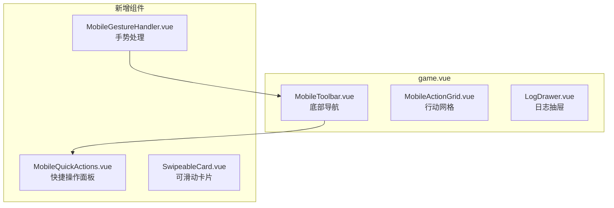

# 移动端体验深化

Feature Name: mobile-experience-v1.1
Updated: 2026-04-29

## 1. Description

优化游戏在移动设备上的用户体验，包括触摸交互优化、底部导航功能增强、以及手势支持。目标是让玩家在手机/平板上也能流畅游玩，不出现误触或操作困难的问题。

## 2. Motivation

当前游戏已经支持响应式布局（640px 断点），但移动端体验仍有以下问题：

| 问题 | 影响 |
|------|------|
| 底部导航功能单一 | 玩家需要多次点击才能完成存档、借贷等操作 |
| 缺少手势支持 | 无法使用滑动手势快速返回或切换面板 |
| 触摸反馈不明显 | 玩家不确定操作是否成功 |
| 日志面板不便 | 移动端日志需要打开抽屉查看 |

## 3. Architecture

### 3.1 组件结构



### 3.2 移动端布局

```
┌─────────────────────────────┐
│  Header: 日程面板 + 存档    │  <- 紧凑头部
├─────────────────────────────┤
│  Stats Card                 │  <- 状态面板
├─────────────────────────────┤
│  Log Preview / Drawer Btn   │  <- 日志入口
├─────────────────────────────┤
│  Debt Dashboard             │  <- 债务仪表盘
├─────────────────────────────┤
│  Action Grid (2x3)          │  <- 行动网格
├─────────────────────────────┤
│  Class Perks / Model       │  <- 班级特权/3D模型
├─────────────────────────────┤
│  [存档] [统计] [分享] [日志] [首页] │  <- 底部导航
└─────────────────────────────┘
```

## 4. Components

### 4.1 MobileToolbar 增强

**现有功能**:
- 存档按钮（仅保存到 slot1）
- 统计按钮（未实现）
- 分享按钮
- 日志按钮
- 首页按钮

**增强功能**:
| 功能 | 描述 |
|------|------|
| 快捷操作 | 点击展开借贷/还款/推演快捷入口 |
| 债务摘要 | 显示当前债务金额（点击展开详情） |
| 状态指示 | 显示当前时段（清晨/午后/深夜） |

### 4.2 MobileGestureHandler

**手势支持**:
| 手势 | 方向 | 动作 |
|------|------|------|
| 滑返回 | 右滑 > 50px | 返回首页 |
| 快速保存 | 底部上滑 > 100px | 保存到当前槽位 |

### 4.3 SwipeableCard

用于存档列表，支持左滑显示删除按钮。

### 4.4 MobileQuickActions

底部导航展开的快捷操作面板：
- 借贷
- 还款
- 推演沙盘
- 总结面板

## 5. Data Models

### 5.1 MobileState

```typescript
interface MobileState {
  /** 底部工具栏展开状态 */
  toolbarExpanded: boolean
  /** 当前活跃的快捷操作 */
  activeQuickAction: 'borrow' | 'repay' | 'sandbox' | 'summary' | null
  /** 手势状态 */
  gesture: {
    startX: number
    startY: number
    direction: 'left' | 'right' | 'up' | null
  }
}
```

## 6. Touch Optimization Details

### 6.1 触摸区域标准

| 元素 | 最小尺寸 | 当前尺寸 |
|------|---------|---------|
| 底部导航按钮 | 48x48px | 48x48px ✓ |
| 行动按钮 | 48x48px | 64x48px ✓ |
| 卡片内元素 | 44x44px | - |

### 6.2 触摸反馈

| 状态 | 反馈效果 |
|------|---------|
| 按下 | scale(0.97) + 边框高亮 |
| 长按 | 震动反馈（如果支持）|
| 成功 | 短暂绿色边框闪烁 |
| 失败 | 短暂红色边框闪烁 |

## 7. Requirements

### R-01: 底部导航增强

**User Story**: 作为玩家，我希望在底部导航快速访问借贷、还款等功能，避免在游戏中频繁穿梭。

#### Acceptance Criteria

1. WHEN 玩家点击底部导航的"更多"按钮, THEN 显示快捷操作面板
2. WHEN 玩家点击快捷操作, THEN 打开对应的弹窗或面板
3. WHEN 底部工具栏展开时点击遮罩, THEN 关闭工具栏

### R-02: 滑动手势支持

**User Story**: 作为玩家，我希望使用滑动手势快速返回首页，节省操作时间。

#### Acceptance Criteria

1. WHEN 玩家在游戏页面右滑超过 50px, THEN 显示返回首页确认
2. WHEN 玩家右滑超过 100px, THEN 直接返回首页
3. WHEN 滑动距离不足 50px, THEN 不触发任何动作

### R-03: 触摸反馈优化

**User Story**: 作为玩家，我希望每次触摸都有明确的视觉反馈，知道操作是否被识别。

#### Acceptance Criteria

1. WHEN 玩家点击任意可交互元素, THEN 显示按下动画（scale 0.97）
2. WHEN 操作成功时, THEN 显示绿色边框闪烁（200ms）
3. WHEN 操作失败时, THEN 显示红色边框闪烁（200ms）

### R-04: 移动端日志体验

**User Story**: 作为玩家，我希望在移动端能快速浏览历史日志，不需要复杂的导航。

#### Acceptance Criteria

1. WHEN 玩家在日志面板左右滑动, THEN 切换查看不同日期的日志
2. WHEN 玩家点击日志条目, THEN 展开显示完整内容
3. WHEN 日志数量超过 20 条, THEN 显示"加载更多"按钮

### R-05: 存档滑动操作

**User Story**: 作为玩家，我希望在移动端通过滑动快速删除不需要的存档。

#### Acceptance Criteria

1. WHEN 玩家在存档卡片上左滑, THEN 显示删除按钮
2. WHEN 玩家点击删除按钮, THEN 显示确认对话框
3. WHEN 玩家确认删除, THEN 清空该存档槽位

## 8. Correctness Properties

| Property | Description |
|----------|-------------|
| P-01 | 底部导航始终可见，不遮挡内容 |
| P-02 | 所有触摸目标至少 44x44px |
| P-03 | 手势识别延迟 < 100ms |
| P-04 | 动画帧率保持在 60fps |
| P-05 | 不影响桌面端现有功能 |

## 9. Error Handling

| Scenario | Handling |
|----------|----------|
| 手势识别失败 | 回退到点击操作 |
| 震动 API 不可用 | 静默失败，使用视觉反馈 |
| 触摸事件冲突 | 优先响应最早的事件 |

## 10. Test Strategy

| Test Type | Coverage |
|-----------|----------|
| 单元测试 | MobileState 管理、手势逻辑 |
| 组件测试 | MobileToolbar、MobileActionGrid 交互 |
| E2E 测试 | 完整移动端用户流程 |
| 手动测试 | 多种移动设备兼容性 |

## 11. References

- [MDN Touch Events](https://developer.mozilla.org/en-US/docs/Web/API/Touch_events)
- [Vue Touch Events](https://github.com/vuejs/vue-touch)
- [game.vue 响应式布局](./app/pages/game.vue#L625-L636)
