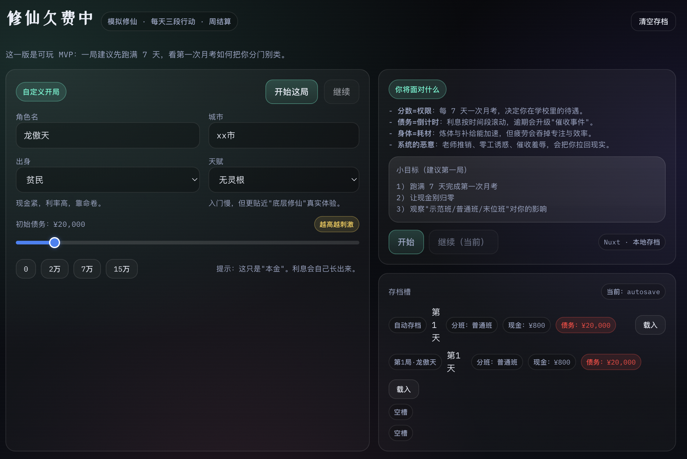
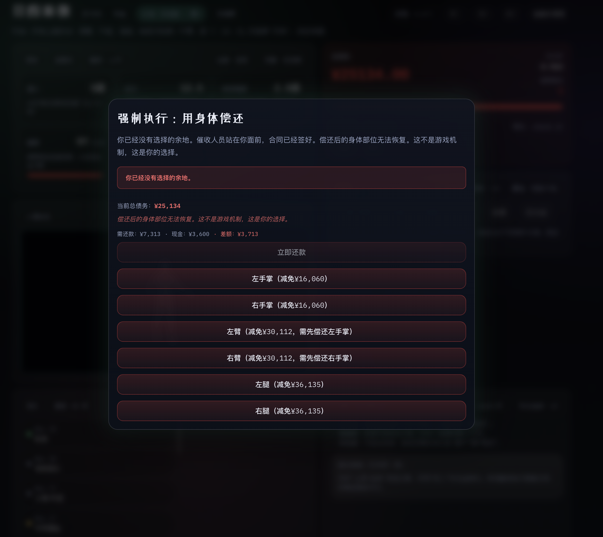

# 修仙欠费中

> **在压迫中挣扎求存 · 在绝望中寻找出路**  
> 一款探索修仙世界中阶级固化、债务螺旋与生存压力的赛博朋克风格模拟经营游戏

[](https://no-money-xiuxian.vercel.app/)

[](https://nuxt.com)
[](https://vuejs.org)
[](https://www.typescriptlang.org)
[](./LICENSE)

[在线游玩](https://no-money-xiuxian.vercel.app/) · [快速开始](#-快速开始) · [贡献指南](#-贡献指南) · [事件创作](./docs/事件创作指南.md)

</div>

---

## 📸 游戏截图

<div align="center">

### 开局配置页面
*自定义角色、选择出身、设置初始债务*



### 游戏主界面
*三段式时间系统、属性面板、债务仪表盘、3D 人体模型*


### 身体偿还事件
*当债务无法偿还时，系统会提供"另一种选择"*



</div>

---

## 📖 项目简介

**修仙欠费中**是一款沉浸式的修仙模拟经营游戏，玩家扮演一名背负债务的高中生，在修仙高中的体系中挣扎求存。游戏核心机制围绕四个主题展开：
- **分数 = 权限**：每 7 天一次月考，决定你的分班（示范班/普通班/末位班）和待遇
- **债务 = 倒计时**：利息按时间段滚动，逾期会触发催收事件
- **身体 = 耗材**：炼体与补给能加速修行，但疲劳会吞噬专注与效率
- **系统的恶意**：老师推销、零工诱惑、催收羞辱，将你拉回现实

游戏采用赛博朋克/反乌托邦美学风格，通过视觉设计强化"债务压迫"和"系统剥削"的核心体验。

---

## ✨ 核心特性

### 游戏机制
- **三段式时间系统**：每天分为清晨、午后、深夜三个时间段，每段只能执行一次行动
- **多维度属性系统**：道心、法力、肉体强度、疲劳、专注等多项指标相互影响
- **动态分班系统**：月考成绩决定分班，不同班级享受不同待遇和资源
- **债务管理系统**：本金、利息、日利率、逾期等级，模拟真实的债务压力
- **随机事件系统**：催收提醒、老师推销、零工通知、请神契约等多种事件
- **因果涌现引擎（CEE）**：情感记忆、因果图预测、涌现事件生成、社会网络、隐变量追踪
- **推演沙盘**：玩家可预览行为后果，辅助决策
- **存档系统**：`localStorage` 单键容器，含 `autosave` + 三个手动槽；根级 **`saveSchemaVersion`**（当前为 `2`）

### 存档与兼容性（v1.0）

- **当前存储键**：`kunxu_sim_save_v2`（`localStorage`），JSON 根级含 **`saveSchemaVersion`**。
- **自动存档与双写**：手动存盘时，当前槽与 `autosave` 会一并更新（活跃槽为 `autosave` 时只写一次）；写入带 **~500ms 防抖** 合并落盘。
- **不再兼容旧实验存档**：历史键 **`kunxu_sim_save_v1`** **不提供导入与自动迁移**；若你曾使用极早期本地数据，请在开局页 **新开一局**（旧数据不会被升级进 v2 容器）。
- **进站流程**：始终从开局页 `/` 进入再载入，避免书签直进 `/game` 与未落盘写入竞态。

### 技术特性
- **现代化技术栈**：Nuxt 3 + Vue 3 Composition API + TypeScript
- **原生 CSS 设计系统**：完整的 CSS 变量系统，支持赛博朋克主题
- **响应式设计**：支持桌面端、平板端和移动端
- **组件化架构**：原子组件（Button, Card, ProgressBar, Pill）+ 复合组件（StatPanel, LogPanel, DebtDashboard, EventModal, DeductionSandbox）
- **状态管理**：基于 Vue 3 Composition API 的 `useGame` composable（含 CEE 集成）
- **因果涌现引擎**：5 个独立 CEE 模块（情感记忆、因果图、涌现事件、社会网络、隐变量）
- **类型安全**：完整的 TypeScript 类型定义（含 CEE 类型）
- **100% 单元测试覆盖**：Vitest 框架，400+ 测试用例

---

## 🎮 游戏玩法

### 开局配置
- 自定义角色名、城市、出身（贫民/中产/富户）
- 选择天赋（无灵根/伪灵根/天灵根）
- 设置初始债务（0-20万灵石）

### 核心行动（时间段内 6 项）
与代码中 `ActionId` 一致：`study`（上课/刷题）、`tuna`（吐纳）、`train`（炼体）、`parttime`（打工）、`buy`（买补给）、`rest`（休息）。借贷/还款为面板操作，不占用单段行动槽。

### 债务管理
- **借贷**：快速获得现金，但利息会不断累积
- **还款**：偿还债务，优先偿还利息
- **逾期后果**：逾期等级上升，触发更频繁的催收事件

### 月考与分班
- 每 7 天进行一次月考
- 成绩决定分班：示范班（最佳待遇）、普通班（中等待遇）、末位班（最差待遇）
- 不同分班影响餐补、专注加成等资源获取

---

## 🚀 快速开始

### 在线体验（推荐）

直接访问 [https://no-money-xiuxian.vercel.app/](https://no-money-xiuxian.vercel.app/)，无需安装任何东西。

### 本地运行

#### 环境要求
- Node.js 18.x 或更高版本
- npm / pnpm / yarn / bun

#### 安装依赖

```bash
# 克隆仓库
git clone https://github.com/your-username/xiuxian-sim.git
cd xiuxian-sim

# 安装依赖（选择一种）
npm install
# 或
pnpm install
# 或
yarn install
# 或
bun install
```

#### 开发模式

启动开发服务器，访问 `http://localhost:3000`：

```bash
npm run dev
```

#### 生产构建

```bash
# 构建生产版本
npm run build

# 预览生产构建
npm run preview
```

---

## 📁 项目结构

```
xiuxian-sim/
├── app/
│   ├── assets/css/
│   │   └── main.css              # 全局样式和设计系统
│   ├── components/
│   │   ├── ui/                   # 原子组件（Button, Card, Pill, ProgressBar…）
│   │   └── game/                 # 游戏组件（StatPanel, LogPanel, DebtDashboard, EventModal, HumanModelViewer, DeductionSandbox…）
│   ├── composables/
│   │   ├── useGame.ts            # 游戏状态与行动/事件主逻辑（含 CEE 集成）
│   │   ├── useGameStorage.ts     # localStorage 容器、槽位、防抖落盘
│   │   ├── useGameStorage.helpers.ts  # 存档 schema、双写策略（可单测）
│   │   ├── useEmotionalMemory.ts # 情感记忆 CEE 模块
│   │   └── useCausalGraph.ts     # 因果图 CEE 模块
│   ├── logic/
│   │   ├── gameEngine.ts         # 纯函数规则（考试、分班、事件门控等）
│   │   ├── emotionalMemoryLayer.ts   # CEE Phase 1: 情感记忆层
│   │   ├── causalGraphEngine.ts      # CEE Phase 2: 因果图引擎
│   │   ├── emergentEventGenerator.ts # CEE Phase 3: 涌现事件生成器
│   │   ├── socialNetworkEngine.ts    # CEE Phase 4: 社会网络引擎
│   │   └── hiddenVariableEngine.ts   # CEE Phase 5: 隐变量引擎
│   ├── pages/
│   │   ├── index.vue             # 开局页（存档槽、继续、新局）
│   │   ├── game.vue              # 游戏主页（含推演按钮）
│   │   └── dev/                  # 开发/实验页
│   ├── types/
│   │   └── game.ts               # TypeScript 类型定义（含 CEE 类型）
│   └── utils/
│       ├── events.ts             # 事件辅助
│       └── rng.ts                # 随机数生成器（seeded）
├── data/
│   ├── events.json               # 基础事件数据
│   └── eventTemplates.json        # 涌现事件模板（CEE 驱动）
├── docs/                         # 机制说明与流程文档
├── public/models/                # 3D 模型资源
└── nuxt.config.ts                # Nuxt 配置
```

单测：`app/**/*.spec.ts`（Vitest，20+ 测试文件，400+ 测试用例）。

### 核心特性

- **组件化架构**：原子组件 + 复合组件，易于维护和扩展
- **状态管理**：基于 Vue 3 Composition API 的 `useGame` composable，无需 Vuex/Pinia
- **因果涌现引擎**：5 个独立 CEE 模块，提供预测与涌现叙事
- **类型安全**：完整的 TypeScript 类型定义，减少运行时错误
- **数据驱动**：事件系统完全由 JSON 配置，非开发者也能贡献内容
- **响应式设计**：支持桌面端、平板端和移动端
- **全面测试**：Vitest 单元测试，100% 覆盖率

---

## 📚 文档

- [事件创作指南](./docs/事件创作指南.md) — 面向非开发者的事件 JSON 编写说明
- [交互流程图](./docs/交互流程图.md) — 页面流、核心循环与存档/契约要点
- [系统逻辑总览](./docs/系统逻辑总览.md) — 属性、行动数值、事件与联动关系
- [代码全流程与功能事件概率总览](./docs/代码全流程与功能事件概率总览.md) — 从页面到 `useGame` / 引擎与概率门控的总览（适合评审与 onboarding）
- [UI/UX 设计规范](./.kiro/specs/ui-ux-game-optimization/) — UI/UX 设计系统（若目录存在）

---

## 🎯 产品路线图

### ✅ v1.0（已交付）

单机 Web 可玩版本，包含以下核心功能：

**基础游戏系统**
- 无限天三时段循环（清晨/午后/深夜）
- 债务管理系统（本金、利息、逾期等级、催收事件）
- 动态分班系统（月考成绩决定分班与待遇）
- 随机事件系统（催收、推销、零工、契约等）
- localStorage 存档（schema v2、双写、防抖）
- 响应式主流程（桌面/平板/移动端）

**因果涌现引擎（CEE）**
- **情感记忆层**：记录玩家行为模式与情绪反应
- **因果图引擎**：追踪因果链条，预测潜在事件
- **涌现事件生成器**：基于上下文动态生成独特叙事
- **社会网络引擎**：NPC 关系动态演化
- **隐变量引擎**：追踪压力、焦虑等隐藏状态
- **推演沙盘**：玩家可预览行为后果

**契约反噬与心理主题收束**（无硬 Game Over）

### 📋 下一里程碑（v1.1 规划中）

- **移动端体验深化**：触摸优化、底部导航、手势支持
- **成就系统**：记录玩家的"生存轨迹"
- **更多涌现事件模板**：丰富事件多样性
- **NPC 关系追踪面板**：可视化展示 NPC 态度变化
- **隐变量 UI**：压力/焦虑等状态可视化

### 📋 长期设想（v2.0+）
- **试功/试药系统**：企业试功事件，可能造成内伤/奖励现金/获得新功法
- **法赛系统**：奖金驱动的竞赛，投入资源冲刺 vs 保守稳债
- **灵根租赁系统**：短期效率暴涨 vs 债务与副作用上升
- **静室系统**：付费获得更好的修炼环境
- **老师推销系统扩展**：更多"正规货"与羞辱选项
- **债务重组系统扩展**：学校补助、班主任介入
- **多结局系统**：根据玩家选择触发不同结局
- **云存档与账号系统**（需评估与「孤立受压」主题的一致性）

---

## 🤝 贡献指南

欢迎贡献代码、报告问题或提出建议！

### 我能做什么？

#### 1. 创作事件（无需编程经验）

游戏的所有事件都存储在 `data/events.json`（基础事件）和 `data/eventTemplates.json`（涌现事件模板）中，你可以：
- 复制现有事件，修改文案和数值
- 提交 Pull Request 或在 Issue 中分享你的点子

详见 [事件创作指南](./docs/事件创作指南.md)。

#### 2. 报告 Bug

在 [Issues](https://github.com/your-username/xiuxian-sim/issues) 中提交 Bug 报告，请包含：
- 复现步骤
- 预期行为 vs 实际行为
- 截图或录屏（如果可能）

#### 3. 提出建议

在 [Discussions](https://github.com/your-username/xiuxian-sim/discussions) 中分享你的想法：
- 新的游戏机制
- UI/UX 改进建议
- 平衡性调整

#### 4. 贡献代码

1. Fork 本仓库
2. 创建特性分支 (`git checkout -b feature/AmazingFeature`)
3. 提交更改 (`git commit -m 'Add some AmazingFeature'`)
4. 推送到分支 (`git push origin feature/AmazingFeature`)
5. 开启 Pull Request

### 代码规范

- 使用 TypeScript 进行类型检查
- 遵循 Vue 3 Composition API 最佳实践
- 保持组件单一职责
- 编写清晰的注释和文档
- 运行 `npm run validate:events` 验证事件数据

---

## 🙏 致谢

### 灵感来源

本游戏的核心设计灵感源于小说《没钱修什么仙？》（作者：熊狼狗）。小说对修仙世界中**分数、债务与系统性压迫**的深刻探讨，启发了我们创作这款游戏。

### 设计灵感

- **赛博朋克 2077**：霓虹美学、反乌托邦氛围
- **Blade Runner**：压抑的视觉风格
- **Papers, Please**：系统性压迫的游戏化表达
- **This War of Mine**：生存压力与道德困境

### 技术支持

- [Nuxt 3](https://nuxt.com) - 强大的 Vue 3 全栈框架
- [Vue 3](https://vuejs.org) - 渐进式 JavaScript 框架
- [Three.js](https://threejs.org) - WebGL 3D 库
- [Vercel](https://vercel.com) - 免费的部署平台

---

## 📄 许可证

本项目仅供学习和交流使用。

---

## 📞 联系方式

如有问题或建议，欢迎通过以下方式联系：

- 提交 [Issue](https://github.com/your-username/xiuxian-sim/issues)
- 发起 [Discussion](https://github.com/your-username/xiuxian-sim/discussions)
- 提交 [Pull Request](https://github.com/your-username/xiuxian-sim/pulls)

---

## 🌟 Star History

如果你喜欢这个项目，请给我们一个 Star ⭐️

[](https://star-history.com/#your-username/xiuxian-sim&Date)

---

<div align="center">

**记住：欠费不停，修仙不止。**

[立即体验](https://no-money-xiuxian.vercel.app/) · [查看文档](./docs/) · [贡献代码](#-贡献指南)

Made with 💀 by the Xiuxian Sim Team

</div>