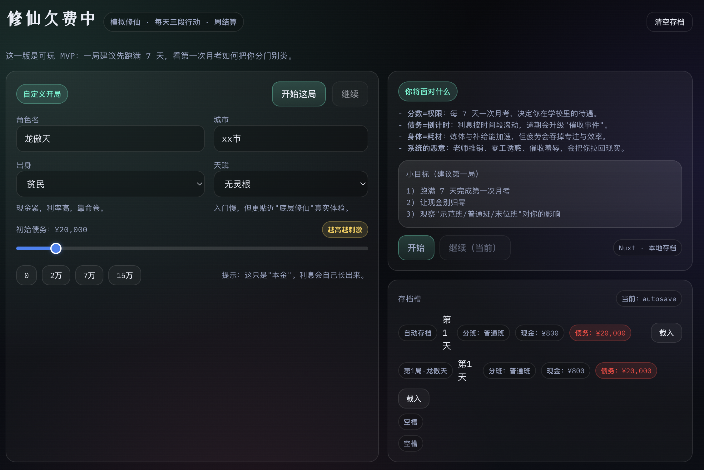
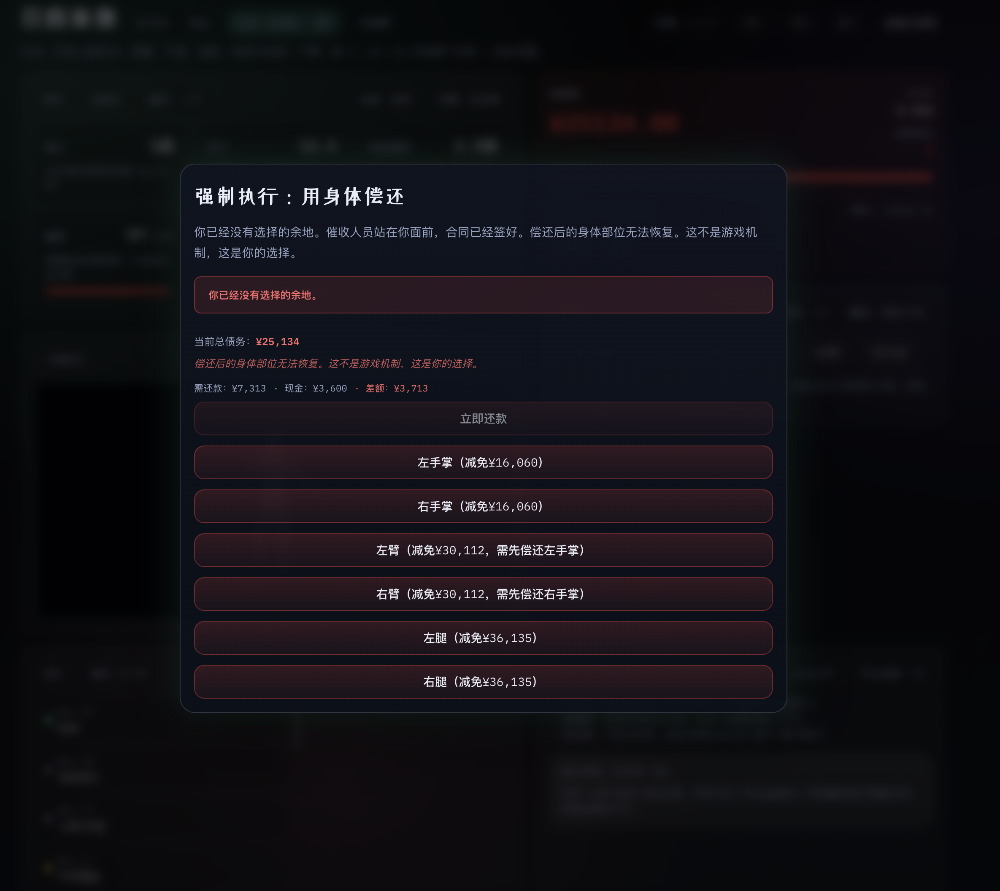

# 修仙欠费中

<div align="center">

> **在压迫中挣扎求存 · 在绝望中寻找出路**  
> 一款探索修仙世界中阶级固化、债务螺旋与生存压力的赛博朋克风格模拟经营游戏

[](https://no-money-xiuxian.vercel.app/)

[](https://nuxt.com)
[](https://vuejs.org)
[](https://www.typescriptlang.org)
[](./app/)
[](./LICENSE)

[在线游玩](https://no-money-xiuxian.vercel.app/) · [快速开始](#-快速开始) · [贡献指南](#-贡献指南) · [事件创作](./docs/事件创作指南.md)

</div>

---

## 🌟 项目亮点

- **AI 驱动内容生成**：集成 Groq LLM，根据玩家状态动态生成个性化事件
- **因果涌现引擎**：5 个独立模块模拟情感记忆、因果链、社会网络等复杂系统
- **身体抵押赎身机制**：指数增长赎身公式，创造"越陷越深"的债务螺旋体验
- **社会画像系统**：四维评估玩家行为模式，动态影响事件触发和难度
- **制度档案页面**：记录画像历史、风险评分演变与标签时间线，赛博朋克风格可视化
- **655 个单元测试**：100% 覆盖核心逻辑，确保代码质量和可维护性

---

## 📸 游戏截图

<div align="center">

### 开局配置页面
*自定义角色、选择出身、设置初始债务*



### 游戏主界面
*三段式时间系统、属性面板、债务仪表盘、3D 人体模型*


### 身体偿还事件
*当债务无法偿还时，系统会提供"另一种选择"*



</div>

---

## 📖 项目简介

**修仙欠费中**是一款沉浸式的修仙模拟经营游戏，玩家扮演一名背负债务的高中生，在修仙高中的体系中挣扎求存。游戏核心机制围绕四个主题展开：
- **分数 = 权限**：每 7 天一次月考，决定你的分班（示范班/普通班/末位班）和待遇
- **债务 = 倒计时**：利息按时间段滚动，逾期会触发催收事件
- **身体 = 耗材**：炼体与补给能加速修行，但疲劳会吞噬专注与效率
- **系统的恶意**：老师推销、零工诱惑、催收羞辱，将你拉回现实

游戏采用赛博朋克/反乌托邦美学风格，通过视觉设计强化"债务压迫"和"系统剥削"的核心体验。

---

## ✨ 核心特性

### 游戏机制

- **三段式时间系统**：每天分为清晨、午后、深夜三个时间段，每段只能执行一次行动
- **多维度属性系统**：道心、法力、肉体强度、疲劳、专注等多项指标相互影响
- **动态分班系统**：月考成绩决定分班，不同班级享受不同待遇和资源
- **债务管理系统**：本金、利息、日利率、逾期等级、系统费用池，模拟真实的债务压力
- **身体抵押与赎身机制**：6 个身体部位可抵押偿还债务，抵押后债务锁定，需支付指数增长的赎身金解锁
- **契约反噬系统**：请神契约的缠绕度与监工 vigilance 追踪，反噬倒计时强制选择
- **社会画像系统**：财务风险、教育信用、制度顺从、身体资产四维评估，动态影响事件触发
- **制度档案页面**：`/profile` 路由，风险评分仪表盘（conic-gradient 圆形仪表盘）、标签时间线、评估历史表格、系统评语生成，赛博朋克深色主题
- **随机事件系统**：催收提醒、老师推销、零工通知、请神契约等多种事件
- **因果涌现引擎（CEE）**：情感记忆、因果图预测、涌现事件生成、社会网络、隐变量追踪
- **推演沙盘**：玩家可预览行为后果，辅助决策
- **AI 事件生成**：集成 Groq LLM（llama-3.3-70b），根据玩家实时状态动态生成个性化事件
- **存档系统**：`localStorage` 单键容器，含 `autosave` + 三个手动槽；根级 **`saveSchemaVersion`**（当前为 `2`）

### 存档与兼容性（v1.0）

- **当前存储键**：`kunxu_sim_save_v2`（`localStorage`），JSON 根级含 **`saveSchemaVersion`**。
- **自动存档与双写**：手动存盘时，当前槽与 `autosave` 会一并更新（活跃槽为 `autosave` 时只写一次）；写入带 **~500ms 防抖** 合并落盘。
- **不再兼容旧实验存档**：历史键 **`kunxu_sim_save_v1`** **不提供导入与自动迁移**；若你曾使用极早期本地数据，请在开局页 **新开一局**（旧数据不会被升级进 v2 容器）。
- **进站流程**：始终从开局页 `/` 进入再载入，避免书签直进 `/game` 与未落盘写入竞态。

### 技术特性

- **现代化技术栈**：Nuxt 4 + Vue 3 Composition API + TypeScript
- **原生 CSS 设计系统**：完整的 CSS 变量系统，支持赛博朋克主题
- **响应式设计**：支持桌面端、平板端和移动端
- **组件化架构**：原子组件（Button, Card, ProgressBar, Pill）+ 复合组件（StatPanel, LogPanel, DebtDashboard, EventModal, DeductionSandbox）
- **状态管理**：基于 Vue 3 Composition API 的 `useGame` composable（含 CEE 集成），无需 Vuex/Pinia
- **因果涌现引擎**：5 个独立 CEE 模块（情感记忆、因果图、涌现事件、社会网络、隐变量）
- **AI 事件生成**：服务端集成 Groq API，客户端智能 Prompt 设计，状态感知数值生成
- **类型安全**：完整的 TypeScript 类型定义（687 行，含 CEE 类型）
- **100% 单元测试覆盖**：Vitest 框架，655 个测试用例，覆盖核心逻辑与边缘场景
- **性能优化**：CEE 模块动态导入 + `requestIdleCallback` 延迟加载，首页轻量级 composable

---

## 🎮 游戏玩法

### 开局配置
- 自定义角色名、城市、出身（贫民/中产/富户）
- 选择天赋（无灵根/伪灵根/天灵根）
- 设置初始债务（0-20万灵石）

### 核心行动（时间段内 6 项）
与代码中 `ActionId` 一致：`study`（上课/刷题）、`tuna`（吐纳）、`train`（炼体）、`parttime`（打工）、`buy`（买补给）、`rest`（休息）。借贷/还款为面板操作，不占用单段行动槽。

### 债务管理
- **借贷**：快速获得现金，但利息会不断累积
- **还款**：偿还债务，优先偿还利息
- **逾期后果**：逾期等级上升，触发更频繁的催收事件

### 月考与分班
- 每 7 天进行一次月考
- 成绩决定分班：示范班（最佳待遇）、普通班（中等待遇）、末位班（最差待遇）
- 不同分班影响餐补、专注加成等资源获取

---

## 🚀 快速开始

### 在线体验（推荐）

直接访问 [https://no-money-xiuxian.vercel.app/](https://no-money-xiuxian.vercel.app/)，无需安装任何东西。

### 本地运行

#### 环境要求
- Node.js 18.x 或更高版本
- npm / pnpm / yarn / bun

#### 安装依赖

```bash
# 克隆仓库
git clone https://github.com/moyunzero/XiuXian-Overdue.git
cd XiuXian-Overdue

# 安装依赖（选择一种）
npm install
# 或
pnpm install
# 或
yarn install
# 或
bun install
```

#### 开发模式

启动开发服务器，访问 `http://localhost:3000`：

```bash
npm run dev
```

#### 生产构建

```bash
# 构建生产版本
npm run build

# 预览生产构建
npm run preview
```

#### 运行测试

```bash
# 运行所有单元测试
npm run test

# 运行测试并生成覆盖率报告
npm run test:coverage

# 验证事件数据格式
npm run validate:events
```

---

## 🧪 测试

项目使用 Vitest 作为测试框架，包含 655 个测试用例（35 个测试文件）：

- **游戏引擎测试**：考试分数计算、分班逻辑、事件门控
- **经济系统测试**：借贷、还款、利息计算、逾期处理
- **身体抵押与赎身测试**：估值算法、赎身倍率、状态变更
- **CEE 模块测试**：情感记忆、因果图、涌现事件、社会网络、隐变量
- **存档系统测试**：序列化、反序列化、版本迁移、防抖策略
- **AI 事件生成测试**：Prompt 构建、JSON 解析、数值校验

所有测试位于 `app/**/*.spec.ts`，覆盖核心逻辑与边缘场景。

---

## 📁 项目结构

```
xiuxian-sim/
├── app/
│   ├── assets/css/
│   │   └── main.css              # 全局样式和赛博朋克设计系统
│   ├── components/
│   │   ├── ui/                   # 原子组件（Button, Card, Pill, ProgressBar…）
│   │   └── game/                 # 游戏组件（StatPanel, LogPanel, DebtDashboard, EventModal, HumanModelViewer, DeductionSandbox…）
│   ├── composables/              # Vue 组合式函数（44个文件）
│   │   ├── useGame.ts            # 主编排器（221行，统一导出所有子模块）
│   │   ├── useGameState.ts       # 核心响应式状态管理
│   │   ├── useGameActionExecutor.ts  # 行动执行编排
│   │   ├── useGameEconomyActions.ts  # 经济操作（借贷/还款/赎身）
│   │   ├── useGameEventResolver.ts   # 事件解析与触发
│   │   ├── useGameComputed.ts    # 派生指标计算（生存压力、债务比等）
│   │   ├── useGameStorage.ts     # localStorage 容器、槽位、防抖落盘
│   │   ├── useGameStorage.helpers.ts  # 存档 schema、双写策略（可单测）
│   │   ├── useEmotionalMemory.ts # 情感记忆 CEE 模块
│   │   ├── useCausalGraph.ts     # 因果图 CEE 模块
│   │   ├── useAiEventGenerator.ts    # AI 事件生成客户端
│   │   └── useGameForIndex.ts    # 首页轻量级 composable（避免加载 CEE）
│   ├── logic/                    # 纯函数规则引擎（19个文件）
│   │   ├── gameEngine.ts         # 核心规则（1341行，考试/分班/事件门控/身体抵押/赎身）
│   │   ├── gameEngine.redemption.spec.ts  # 赎身机制单元测试
│   │   ├── emotionalMemoryLayer.ts   # CEE Phase 1: 情感记忆层
│   │   ├── causalGraphEngine.ts      # CEE Phase 2: 因果图引擎
│   │   ├── emergentEventGenerator.ts # CEE Phase 3: 涌现事件生成器
│   │   ├── socialNetworkEngine.ts    # CEE Phase 4: 社会网络引擎
│   │   └── hiddenVariableEngine.ts   # CEE Phase 5: 隐变量引擎
│   ├── pages/
│   │   ├── index.vue             # 开局页（存档槽、继续、新局）
│   │   ├── game.vue              # 游戏主页（含推演按钮）
│   │   ├── profile.vue           # 制度档案页（风险仪表盘、标签时间线、评估历史）
│   │   └── dev/                  # 开发/实验页（AI 事件生成器等）
│   ├── types/
│   │   └── game.ts               # TypeScript 类型定义（687行，含 CEE 类型）
│   └── utils/
│       ├── events.ts             # 事件辅助函数
│       └── rng.ts                # 随机数生成器（seeded）
├── data/
│   ├── events.json               # 基础事件数据（1638行）
│   └── eventTemplates.json       # 涌现事件模板（CEE 驱动）
├── server/api/                   # Nuxt 服务端 API
│   ├── generate-events.post.ts   # AI 事件生成接口（Groq LLM）
│   ├── test-env.get.ts           # 环境变量测试接口
│   └── test-groq.get.ts          # Groq API 连通性测试
├── docs/                         # 项目文档
│   ├── ARCHITECTURE.md           # 架构设计文档
│   ├── 事件创作指南.md           # 面向非开发者的事件 JSON 编写说明
│   └── screenshots/              # 游戏截图资源
├── public/models/                # 3D 模型资源（人体模型）
└── nuxt.config.ts                # Nuxt 配置
```

单测：`app/**/*.spec.ts`（Vitest，35 个测试文件，655 个测试用例）。

### 核心架构模式

**useGame 组合式架构**
```
useGame.ts (主编排器)
├── useGameState()            # 核心响应式状态
├── useGameStorage()          # 存档槽管理
├── useCausalGraph()          # 因果图追踪（动态导入 + requestIdleCallback）
├── socialNetwork             # 社交网络引擎
├── useGameComputed()         # 派生指标（生存压力、债务/现金比等）
├── useEmotionalMemoryStorage()  # 情感记忆存储
├── useGameEconomyActions()   # 经济操作（借贷/还款/赎身）
├── useGameEventResolver()    # 事件解析与触发
├── useGameActionExecutor()   # 行动执行编排
└── useAiEventGenerator()     # AI 事件生成（可选）
```

**设计原则**
- **关注点分离**: 每个模块处理单一领域，便于维护和测试
- **依赖注入**: 模块通过参数接收依赖，支持独立单元测试
- **纯函数规则引擎**: `gameEngine.ts` 等文件提供可测试的纯函数，与 Vue 解耦
- **向后兼容**: `useGame()` 返回 API 保持不变，子模块可独立扩展
- **性能优化**: 首页使用轻量级 `useGameForIndex`，避免加载重型 CEE 模块

---

## 🔢 核心数值与公式

### 考试分数计算

```
base = 400 + daoXin*8 + faLi*6.5 + rouTi*35 + focusBonus - debtPenalty - fatiguePenalty - workPenalty
```

### 事件触发概率

```
base = 0.15（单时段）
delinquencyBonus = 逾期等级 × 0.05
droughtBonus = min(干旱天数 × 0.08, 0.40)
final = clamp(base + bonuses, 0.15, 0.70)
```

### 身体部位基础定价

| 部位 | 基础价格 |
|------|----------|
| 左手掌 | 8,000 |
| 右手掌 | 8,000 |
| 左手臂 | 15,000 |
| 右手臂 | 15,000 |
| 左腿 | 18,000 |
| 右腿 | 18,000 |

动态估值受法力、肉体强度、疲劳、补剂劣化度影响。

### 赎身公式

```
赎身金额 = lockedDebtAmount × 1.5 × 2^(n-1)
（n 为累计抵押次数，倍率指数增长）
```

### 分班标准

| 班级 | 分数要求 | 待遇 |
|------|----------|------|
| 示范班 | >= 600 | 餐补 160/日，专注 +10 |
| 普通班 | >= 540 | 餐补 40/日，专注 +0 |
| 末位班 | < 540 | 无餐补，专注 -6 |

---

## 🤖 AI 事件生成系统

游戏集成了基于 Groq LLM 的 AI 事件生成系统，能够根据玩家实时状态动态生成个性化事件。

### 技术架构

- **服务端 API**：`/api/generate-events`（POST），接收玩家画像和游戏上下文
- **LLM 模型**：llama-3.3-70b-versatile（Groq 平台）
- **智能 Prompt**：状态感知指令 + 数值设计指南，确保生成数值与玩家处境匹配
- **客户端集成**：`useAiEventGenerator` composable，提取派生状态（生存压力、债务比、属性危急程度）

### 状态感知能力

AI 生成系统会考虑以下派生指标：

- **生存压力指数**（0~100）：综合现金、债务、属性状态计算
- **债务/现金比**：判断玩家财务健康状况
- **属性危急程度**：疲劳、专注是否处于危险阈值
- **距离上次还款天数**：评估拖延倾向
- **事件严重程度匹配**：根据压力等级调整事件强度

### 数值设计指南

AI 严格遵守以下规则：

- 现金 < 500 时，避免生成大额支出选项
- 债务 > 50,000 时，现金收益应在 1,000~3,000 才有意义
- 疲劳 > 80 时，避免生成高疲劳代价选项
- 选项之间必须有实质差异（安全/冒险/拒绝选项的权衡）

### 配置方法

在项目根目录创建 `.env` 文件：

```bash
GROQ_API_KEY=your_api_key_here
```

前往 [Groq Console](https://console.groq.com/) 获取 API Key。

---

## 💀 身体抵押与赎身机制

### 身体偿还系统

当债务无法偿还时，系统提供"身体偿还"选项：

- 6 个身体部位可独立抵押（左右手掌、手臂、腿）
- 每个部位有基础定价，动态估值受当前状态影响
- 偿还后身体完整度下降，影响所有行动增益
- 债务进入锁定状态（`bodyLocked`），无法通过普通还款解除

### 赎身机制

抵押后玩家可通过赎身解锁债务：

- **倍率公式**：`1.5 × 2^(n-1)`（n 为累计抵押次数）
- 第一次赎身：锁定金额的 1.5 倍
- 第二次赎身：锁定金额的 3 倍
- 第三次赎身：锁定金额的 6 倍
- 现金不足时，系统会提示具体差额

### 设计意图

创造"越陷越深"但保留一丝希望的游戏体验，反映现实中的债务螺旋困境。

---

## 👤 社会画像系统

系统对玩家进行多维度评估，影响事件触发和难度：

```typescript
interface SocialProfile {
  financialRisk: 'low' | 'medium' | 'high' | 'extreme'    // 财务风险等级
  educationCredit: 'discarded' | 'unstable' | 'investable' | 'preferred'  // 教育信用等级
  compliance: 'resistant' | 'softened' | 'obedient' | 'domesticated'      // 制度顺从程度
  bodyAsset: 'intact' | 'marked' | 'mortgaged' | 'depleted'               // 身体资产状态
  tags: ProfileTagId[]  // 系统标签（如"高风险修士"、"可投资优等生"等）
}
```

画像动态更新，影响：
- 事件触发概率和类型偏好
- AI 生成事件的情境设计
- NPC 态度和互动方式

---

## 📚 文档

- [事件创作指南](./docs/事件创作指南.md) — 面向非开发者的事件 JSON 编写说明
- [架构设计文档](./docs/ARCHITECTURE.md) — 系统架构与技术选型

---

## 🎯 产品路线图

> **核心叙事**: "修仙不是逆天改命，而是无休止的还贷"

### ✅ v1.0 ~ v1.2（已交付）

详见上方「核心特性」章节。

### 📋 v1.3 画像驱动世界（近阶段）

**让画像从隐藏规则层，变成玩家能持续感知的制度身份系统。**

- **画像标签可见化**: 主界面「身份标识」区域，按类型着色（红/蓝/绿/紫），悬停显示标签含义
- **画像驱动事件池分流**: 不同画像进入不同事件池，同一事件呈现不同语气和方案
- **NPC 差异化反馈**: 借贷面板信用评估、打工面板任务分配、NPC 对话文案随画像标签变化
- **画像变更结算报告**: 周结算时显示旧标签 → 新标签、触发原因、影响说明，用冷制度口吻呈现

### 📋 v1.4 身体资产金融化（中阶段前期）

**让身体抵押从"惩罚性减债"升级为被金融化、分级定价和持续折旧的资产系统。**

- **部位差异化用途**: 手掌影响精细操作、手臂影响力量行动、腿影响移动类行动
- **身体折旧与估值市场**: 随时间折旧，定期生成"身体资产评估报告"
- **画像标签联动**: 身体资产维度扩展为 5 级细粒度，NPC 称呼随标签变化
- **世界反馈变化**: 解锁"身体黑市"事件池、学校"残障修士勤工俭学项目"

### 📋 v1.5 制度命运切片（中阶段后期）

**让每局结束后，玩家得到一份能够被分享、被讨论、被记住的"命运报告"。**

- **命运判定卡升级**: 多页面制度档案报告（封面/画像轨迹/身体资产/债务总结/标签词云）
- **可分享卡片生成**: 赛博朋克风格长图，关键数据高亮，底部带 slogan
- **多周目命运摘要**: 存档列表页显示已完成局数的简要摘要
- **驯化与麻木归档卡**: 记录契约进度、精神崩溃次数，表达"越有效率越不像人"

### 📋 v2.0 多周目命运档案（远阶段）

**把项目从单局体验推向"多局命运实验"——世界记得你，而不是只记得你的数值。**

- **轮回继承系统**: 信用残留、身体记忆、制度标签继承、反向继承（反画像路线）
- **世界记得你**: NPC 对话中的"前世记忆"片段，特定轨迹解锁专属事件
- **命运档案库**: 时间轴展示所有周目，支持跨周目画像轨迹对比
- **挣脱系统识别路线**: 连续反画像路线触发"系统无法归类"特殊事件链，导向隐藏结局

### 版本判断标准

每个功能上线前，必须通过以下四问检验：
1. 是否强化了"被定义感"？
2. 是否让画像对世界反馈更真实？
3. 是否增加了短利与长锁的张力？
4. 是否提高了项目的可辨识度？

### 不优先做的功能

- 成就系统、签到系统（与主轴无关）
- 战力排行榜（不符合反爽文定位）
- 云存档与账号系统（核心机制未站稳前不优先）
- 多玩家互动/排行榜（破坏孤立受压的主题一致性）

> 详细路线图设计参考: [docs/plans/2026-05-08-product-roadmap-design.md](./docs/plans/2026-05-08-product-roadmap-design.md)

---

## 🤝 贡献指南

欢迎贡献代码、报告问题或提出建议！

### 我能做什么？

#### 1. 创作事件（无需编程经验）

游戏的所有事件都存储在 `data/events.json`（基础事件）和 `data/eventTemplates.json`（涌现事件模板）中，你可以：
- 复制现有事件，修改文案和数值
- 提交 Pull Request 或在 Issue 中分享你的点子

详见 [事件创作指南](./docs/事件创作指南.md)。

#### 2. 报告 Bug

在 [Issues](https://github.com/moyunzero/XiuXian-Overdue/issues) 中提交 Bug 报告，请包含：
- 复现步骤
- 预期行为 vs 实际行为
- 截图或录屏（如果可能）

#### 3. 提出建议

在 [Discussions](https://github.com/moyunzero/XiuXian-Overdue/discussions) 中分享你的想法：
- 新的游戏机制
- UI/UX 改进建议
- 平衡性调整

#### 4. 贡献代码

1. Fork 本仓库
2. 创建特性分支 (`git checkout -b feature/AmazingFeature`)
3. 提交更改 (`git commit -m 'Add some AmazingFeature'`)
4. 推送到分支 (`git push origin feature/AmazingFeature`)
5. 开启 Pull Request

### 代码规范

- 使用 TypeScript 进行类型检查
- 遵循 Vue 3 Composition API 最佳实践
- 保持组件单一职责
- 编写清晰的注释和文档
- 运行 `npm run validate:events` 验证事件数据
- 运行 `npm run test` 确保测试通过
- 遵循项目代码质量标准（功能正确性、设计架构、可读性、健壮性、规范一致性、性能安全）

### 事件创作工作流

1. 阅读 [事件创作指南](./docs/事件创作指南.md)
2. 复制 `data/events.json` 中的现有事件
3. 修改 `id`（确保唯一）、`title`、`body`、`options`
4. 确保 `effects` 使用合法的 target 字段
5. 运行 `npm run validate:events` 验证格式
6. 提交 Pull Request 或在 Issue 中分享

---

## 🙏 致谢

### 灵感来源

本游戏的核心设计灵感源于小说《没钱修什么仙？》（作者：熊狼狗）。小说对修仙世界中**分数、债务与系统性压迫**的深刻探讨，启发了我们创作这款游戏。

### 设计灵感

- **赛博朋克 2077**：霓虹美学、反乌托邦氛围
- **Blade Runner**：压抑的视觉风格
- **Papers, Please**：系统性压迫的游戏化表达
- **This War of Mine**：生存压力与道德困境

### 技术支持

- [Nuxt 3](https://nuxt.com) - 强大的 Vue 3 全栈框架
- [Vue 3](https://vuejs.org) - 渐进式 JavaScript 框架
- [Three.js](https://threejs.org) - WebGL 3D 库
- [Vercel](https://vercel.com) - 免费的部署平台

---

## 📄 许可证

本项目仅供学习和交流使用。

---

## 📞 联系方式

如有问题或建议，欢迎通过以下方式联系：

- 提交 [Issue](https://github.com/moyunzero/XiuXian-Overdue/issues)
- 发起 [Discussion](https://github.com/moyunzero/XiuXian-Overdue/discussions)
- 提交 [Pull Request](https://github.com/moyunzero/XiuXian-Overdue/pulls)

---

## 🌟 Star History

如果你喜欢这个项目，请给我们一个 Star ⭐️

[](https://star-history.com/#moyunzero/XiuXian-Overdue&Date)

---

<div align="center">

**记住：欠费不停，修仙不止。**

[立即体验](https://no-money-xiuxian.vercel.app/) · [查看文档](./docs/) · [贡献代码](#-贡献指南)

Made with 💀 by the Xiuxian Sim Team

</div>