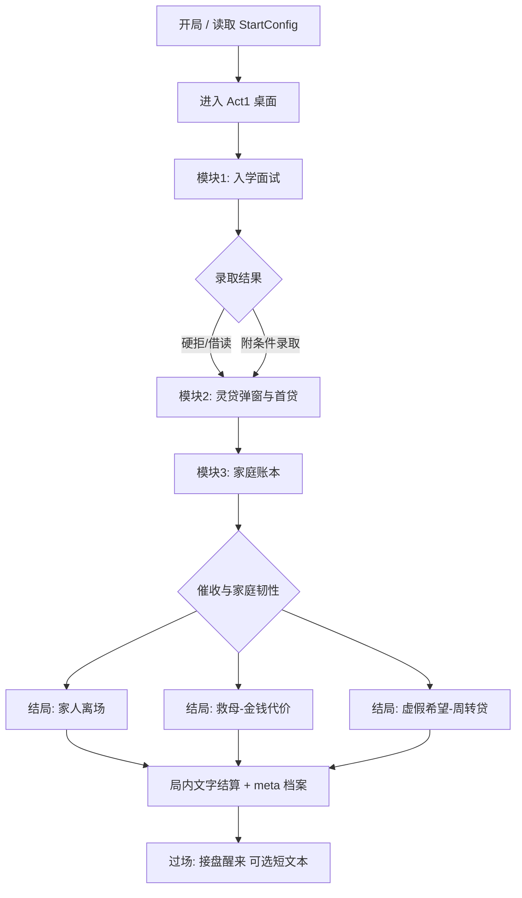

# PRD：周目 1「入学前夜」（Act 1 · Pre-Enrollment）

| 字段 | 内容 |
|------|------|
| 状态 | Draft v0.1（**体验结构以 [ROADMAP-next-iterations.md](./ROADMAP-next-iterations.md) v2 为准**；本文档作机制/变量参考） |
| 对齐文档 | [AGENTS.md](../AGENTS.md)、[README.md](../README.md) |
| 路由（计划） | `/` 开局 → `/act1` 桌面模拟 → 结算 → （未来）周目 2 `/game` |
| 单局时长目标 | 15～25 分钟 |
| 版本范围 | **仅本 PRD 范围**；不含完整高中三段式主循环、法骸、卖精、AI 事件 |

---

## 1. 背景与问题

当前 `/game` 主循环以「三段式点行动 + 弹窗事件」为主，玩家反馈**单调、像上班打卡、缺乏可计算的制度压迫感**。产品核心定位不变：

> 修仙不是逆天改命，而是在**分数、债务、身体**三条制度下与系统讨价还价。

本阶段用小说气质中的三个名场面（面试荒诞、灵贷广告、家庭债务崩盘）提炼为**强系统玩法**，但**不出现原著人名**，玩家始终是「你」。

---

## 2. 目标与非目标

### 2.1 目标（Must）

| ID | 目标 | 验收直觉 |
|----|------|----------|
| G1 | **多窗口桌面模拟**：招生系统、灵贷中心、家庭账本、通知栈分窗操作 | 玩家感到「烦但有理」，而非单屏三连弹窗 |
| G2 | **强系统**：规则可查、后果可预期；隐藏门槛存在但二周目可部分揭示 | 玩家能说「我早知道会输，但还是签了」 |
| G3 | **开局自定义有因果**：`StartConfig` 五项影响面试/利率/家庭初始条件 | 换出身/天赋/债务，结局路径明显不同 |
| G4 | **三条玩法竖切**：① 入学面试 → ② 灵贷广告与首贷 → ③ 家庭账本与催收 | 按顺序可打通一局 |
| G5 | **母亲结局**：默认高压「家人离场」；允许**救母**，代价为**永久金钱类惩罚** | 救母后局内结算明确列出利率/担保类 debuff |
| G6 | **局内文字结算**：制度档案式纯文本报告，**不做**分享图/卡片生成 | 结算屏可读、可复盘标签与合同列表 |
| G7 | **多周目 meta 轻量**：仅继承档案词条/公式可见性，不继承现金 | 二周目面试界面多一行「制度备注」 |

### 2.2 非目标（Won't · 本阶段）

- 完整 `/game` 日循环、月考、身体抵押玩法
- CEE、Groq AI 事件生成（可留短信占位文案）
- 法骸、生物资产、卖精等名场面 4/5 的完整交互
- 分享图、外链海报、账号系统
- 原著角色姓名、可识别梗人设
- 将 `best.md` 打包进前端或公开部署

---

## 3. 用户与叙事原则

### 3.1 人称与角色

- 全文第二人称：**你**
- 制度角色仅职能称呼：招生官、系统评语、灵贷专员、催收员、**家人**（不用「妈」也可，但禁止具名 NPC）
- 开局 `playerName` 仅用于简历/合同/短信抬头变量 `{playerName}`

### 3.2 名场面映射（无版权人名）

| 气质来源 | 系统模块 | 玩家动词 |
|----------|----------|----------|
| 重点高中面试荒诞 | 模块 ① 招生系统 | 填表、对答、看简历入回收站 |
| 天庭式灵贷广告 | 模块 ② 灵贷中心 | 关广告、比价、签约、动用额度 |
| 借贷与家庭崩盘 | 模块 ③ 家庭账本 | 要钱、选支出项、扛催收、决定家人去留 |

### 3.3 核心体验句（设计尺子）

**「每一分钟都在和可计算的恶意讨价还价。」**

---

## 4. 流程总览



**强制顺序（阶段 1）**：面试 → 灵贷 → 家庭。模块内允许分窗切换，但**未办结待办**阻塞进入下一模块。

---

## 5. 桌面壳（Desktop Shell）

### 5.1 布局

```
┌──────────────────────────────────────────────────────────────┐
│ 状态栏: 阶段日 · 现金 · 总负债 · 家庭韧性 · 压力            │
├────────────┬─────────────────────────────┬─────────────────┤
│ 桌面图标    │ 主工作区（当前激活窗口）       │ 通知 / 待办栈    │
│ · 招生系统  │                             │ [未读] 催收×n   │
│ · 灵贷中心  │  面试表 / 合同 / 账本表格      │ [可关] 广告     │
│ · 家庭账本  │                             │ [文件] 家人留言  │
│ · 灵信      │                             │                 │
│ · 回收站    │                             │                 │
└────────────┴─────────────────────────────┴─────────────────┘
```

### 5.2 「烦」的设计要求

| 机制 | 说明 |
|------|------|
| 多窗口 | 同时存在 ≥2 个可打开窗口；切换不丢未保存表单状态 |
| 待办栈 | 催收、广告、系统通知**排队**；部分需先处理 A 才显示 B 详情 |
| 合同签署 | 须滚动至底部 + 勾选必选条款（默认可全选，取消则无法签约） |
| 关广告 | 允许关闭，但记入标签，影响后续推送档位（见模块 ②） |

### 5.3 路由与技术建议

- 新页：`app/pages/act1/index.vue`（或 `pre-enrollment.vue`）
- 逻辑：`app/logic/act1/*` 纯函数 + `app/composables/useAct1.ts`
- 类型：`app/types/act1.ts`（或扩展 `game.ts` 中 `chapter: 'act1'` 子状态）
- **不**在阶段 1 重写 `useGame.ts` 主循环；Act1 结束将 `StartConfig` + `Act1Outcome` 写入存档，供未来周目 2 读取

---

## 6. 开局自定义（StartConfig）传导

沿用 `app/types/game.ts` 的 `StartConfig`，**禁止装饰性字段**。

| 字段 | 影响模块 ① 面试 | 影响模块 ② 灵贷 | 影响模块 ③ 家庭 |
|------|----------------|----------------|----------------|
| `playerName` | 简历抬头、面试官称呼 | 合同借款人 | 家人短信称呼 |
| `startingCity` | 隐藏线：外地生扣分/加分文案 | 地区利率系数（表驱动） | — |
| `background` 贫民/中产/富户 | 公开答案「底气」；家庭韧性初值 | 风控档位；免息资格 | 家庭可榨取资产上限 |
| `talent` 无/伪/天灵根 | 「特招轨道」问答分支解锁 | 「修为额度」产品营销话术 | 培元药剂支出压力 |
| `initialDebt` | 若 >0：面试官提及「已有征信」 | 已有负债合并展示 | 起始催收等级 |

**实现要求**：所有影响通过 `app/logic/act1/startConfigModifiers.ts`（命名可调整）集中计算，UI 只读派生结果；**必须有单元测试**覆盖至少 3 组开局组合。

---

## 7. 模块 ①：入学面试（优先实现）

### 7.1 玩家流程

1. 打开「招生系统」→ 自动载入简历（来自 `StartConfig`）
2. **公开问卷**（睡眠、课程进度、家庭投入）— 玩家以为在展示优秀
3. **追加问询**（绝育/激素、器官贷、魂修、促智环境等「轨道」）
4. 提交 → 后台评分 → 动画：简历入回收站 / 或附条件录取

### 7.2 隐藏门槛表（示例，数值策划可调）

| 维度 | 玩家常见自报 | 系统真实标准（讽刺） | 得分 |
|------|--------------|----------------------|------|
| 日均睡眠 | 5 小时 | 优秀 ≤2h；录取线≈药物维持不睡 | 低 |
| 课程进度 | 学完高一 | 默认：高中课程已自学完 | 低 |
| 绝育/激素管理 | 尚未 | 强扣分；「准备中」勉强 | 中 |
| 轨道声明 | 不了解 | 中性；选「家里在办」 | 中高 + 后续家庭 flag |

「轨道」选项（阶段 1 至少 4 项）：

- 器官抵押贷款知情
- 魂修特长生（放弃肉身）
- 促智环境适应（代谢法器）
- 性别转换招生轨道（仅文案，不涉及敏感实操描写）

### 7.3 结局分支

| 结果 | 条件（示意） | 后续影响 |
|------|--------------|----------|
| **硬拒** | 总分 < 阈值 | 简历进回收站；仍可走「末位借读」但借读费更高 |
| **附条件录取** | 总分 ≥ 阈值 | 生成 `offer` + **借读费分期**（进入模块 ② 强制签约项） |
| **特招邀请**（稀有） | 天赋+轨道+谎言一致 | 文案奖励；数值仍背债（反爽文） |

### 7.4 标签产出（写入 Act1State）

示例：`profileTags[]`：`sleep-deficit`、`track-organ-loan`、`interview-rejected` 等，供灵贷风控与结算展示。

### 7.5 验收标准

- [ ] 至少 8 道题目/步骤，含 1 次「简历入回收站」演出
- [ ] 换 `background`/`talent` 至少改变 2 个门槛或文案分支
- [ ] 纯函数 `scoreInterview(answers, startConfig, hiddenRules)` 有 Vitest

---

## 8. 模块 ②：灵贷广告与首贷

### 8.1 玩家流程

1. 桌面右下角 **灵贷弹窗**（传统「传功」视觉 + 现代合同小字）
2. 操作：**关闭** / **了解更多** / **领取备用修为额度**
3. 「灵贷中心」窗口：≥2 个产品对比表
4. 签约 → 额度入账 → 每次「动用」记一笔债 + 推送还款日

### 8.2 产品表（最少 2 款）

| 产品 ID | 显示名 | 免息天数 | 日息 | 违约金 | 备注 |
|---------|--------|----------|------|--------|------|
| `platform-standard` | 天灵信贷·备用修为 | 30 | 低 | 有 | 对应「大平台」话术 |
| `aggressive-plus` | 急用修为包 | 0 | 高 | 高 | 关广告过多后主推 |

**用语**：原创名称（天灵信贷、备用修为额度），气质对齐但不使用原著固定台词照搬。

### 8.3 关广告与风控

| 行为 | 系统响应 |
|------|----------|
| 快速连关 3 次 | 标签 `ad-resistant` → 推送 `aggressive-plus` |
| 阅读对比表 ≥30s | 标签 `price-aware` → 标准产品利率 -ε（仍高于表面宣传） |
| 签约 | 生成 `LoanContract` 列表项，进入家庭模块「债权人」 |

### 8.4 与面试衔接

- 附条件录取 → 自动待办「借读费分期合同」（可与其他贷款叠加）
- 硬拒走借读 → 借读费利率上浮系数

### 8.5 验收标准

- [ ] 弹窗 + 独立窗口 + 合同滚动签署
- [ ] 签约后总负债、债权人列表在状态栏可见
- [ ] `drawCredit(amount)` 增加本金/利息字段，有测试

---

## 9. 模块 ③：家庭账本与催收

### 9.1 状态条

| 变量 | 范围 | 说明 |
|------|------|------|
| `cash` | ≥0 | 你手上现金 |
| `familyResilience` | 0～100 | 家庭可榨取资源（出身决定初值） |
| `debts[]` | 列表 | 多债权人：借读费、灵贷、周转贷… |
| `delinquency` | 0～n | 逾期等级，驱动催收频率 |
| `pressure` | 0～100 | 展示用，影响部分文案 |

### 9.2 支出项（固定按钮，阶段 1）

玩家向家里「要钱」有冷却；钱花向：

| 支出 ID | 说明 | 对家庭韧性 |
|---------|------|------------|
| `rent-root` | 租灵根 | -大 |
| `pill-pack` | 培元药剂 | -中，停服道心倒退（文案） |
| `cram-vip` | 补习班 VIP | -中 |
| `borrow-fee` | 借读费首期 | -大 |

### 9.3 催收（通知栈）

- 形式：灵信线程 / 电话记录（只读对话 + 1～2 个选项）
- 升级链：`提醒` → `联系人` → `紧急联系人（家人）` → `外访话术（文案）`
- 选「联系家人」→ `familyResilience` 暴跌

### 9.4 母亲/家人结局（已锁定：救母代价 = 钱）

| 结局 ID | 触发（示意） | 叙事结果 | 机制代价（金钱类） |
|---------|--------------|----------|-------------------|
| `family-left` | 韧性归零且继续要钱；或忽视关键催收 | 桌面留言文件，家人离场 | 标准结算；解锁 meta `witness-departure` |
| `family-saved-costly` | 催收关键节点选「你扛下一切」+ 前置：签家庭周转贷或家庭担保 | 家人留下 | **永久**：全周目贷款利率 +Δ%；标签 `family-guarantor`；债权人新增「家庭担保合约」 |
| `family-saved-false-hope` | 再借一笔「家庭周转贷」换暂时缓解 | 家人留下 | 韧性锁 1；每周自动扣息（Act2 继承用）；结算明示「假希望」 |

**明确不做**：救母主要代价为扣身体上限/锁死路线（本阶段仅金钱）。

### 9.5 过场（可选短文本）

局末 3～5 行：你醒来，窗外污水街、墙上「新用户三十天免息」投影、灵信未读。不出现穿越者姓名；meta 提示「制度档案已归档，下一周目开放」。

### 9.6 验收标准

- [ ] ≥3 次要钱/花钱决策后催收明显升级
- [ ] 三条家人结局均可触发（需文档化触发条件给 QA）
- [ ] 纯函数结算 `resolveFamilyEnding(state)` 有测试

---

## 10. 局内文字结算

### 10.1 展示时机

模块 ③ 结局确定后，全屏或独立「制度档案」窗口，**仅文本**，可滚动。

### 10.2 必备段落

1. **身份摘要**：`{playerName}` · `{startingCity}` · 出身/天赋
2. **面试结论**：录取/硬拒/借读 + 关键标签
3. **合同清单**：已签产品、本金、日息、免息剩余天数
4. **家庭结局**：离场 / 救母（代价条文逐条列出）
5. **系统评语**：冷制度口吻 2～3 句
6. **下周目提示**：已解锁词条列表（meta）

### 10.3 非目标

- 图片生成、Canvas 分享卡、复制链接

---

## 11. 数据与存档

### 11.1 建议类型（`app/types/act1.ts`）

```typescript
export type Act1Chapter = 'act1-pre-enrollment'

export interface LoanContract {
  id: string
  lenderName: string
  principal: number
  dailyRate: number
  graceDaysLeft: number
  tags: string[]
}

export interface Act1State {
  chapter: Act1Chapter
  day: number // 阶段内日程，可与未来 30 天制解耦
  interview: { completed: boolean; result?: 'reject' | 'conditional' | 'special'; answers: Record<string, string>; score: number }
  loans: LoanContract[]
  creditLineUsed: number
  familyResilience: number
  familyOutcome?: 'left' | 'saved-costly' | 'saved-false-hope'
  profileTags: string[]
  pendingTodos: string[]
  completedModules: ('interview' | 'loan' | 'family')[]
}

export interface Act1Outcome {
  /** 供周目 2 读取 */
  startConfig: StartConfig
  act1: Act1State
  metaUnlocks: string[]
  permanentModifiers: { interestRateMultiplier?: number }
}
```

### 11.2 存档策略

- 方案 A（推荐）：`saveSchemaVersion: 3`，槽内增加 `act1?: Act1Outcome`，`game` 主状态为空表示仅完成 Act1
- 方案 B：独立键 `kunxu_sim_act1_v1` — 仅当与 v2 主存档耦合成本高时采用
- **必须**：`useGameStorage.spec.ts` 覆盖读写；**不**迁移 v1

---

## 12. 实现分期（工程）

| 波次 | 交付 | 验证 |
|------|------|------|
| W1 | 桌面壳 + 窗口管理 + 待办栈 + Act1 路由 | 可开窗、切窗、堆通知 |
| W2 | 模块 ① 面试 + StartConfig 修饰 + 测试 | G3、模块①验收 |
| W3 | 模块 ② 灵贷 + 合同签署 | 模块②验收 |
| W4 | 模块 ③ 家庭 + 三结局 + 文字结算 | G5、G6 |
| W5 | meta 解锁、开局接入、埋点（可选）、文案通读 | 无原著人名审查 |

**不改**：`/game` 现有逻辑除读取出局 outcome 外，阶段 1 不重构 CEE。

---

## 13. 测试计划

| 类型 | 范围 |
|------|------|
| 单元测试 | `act1/interview*.ts`、`act1/loans*.ts`、`act1/family*.ts`、`startConfigModifiers.ts` |
| 集成测试 | `useAct1` 状态机：模块顺序、待办阻塞 |
| 手工 | 3 组开局 × 3 条家人结局路径 |
| 回归 | `yarn test` 全绿；不动 `data/events.json` 则无需 validate |

---

## 14. 文案与合规检查清单

- [ ] 无原著人名、无可识别配角外号
- [ ] 玩家称呼统一「你」
- [ ] 敏感「轨道」仅制度讽刺，无实操描写
- [ ] 合同/简章中有**具体数字**（利率、免息天数）
- [ ] 救母结局**明示**金钱代价，不隐藏 debuff

---

## 15. 已决议（2026-05-27）

| # | 决议 |
|---|------|
| **O1** | Act1 局末结算后 **返回 `/`**；周目 2（`/game`）在 Act1 `outcome` 存在时由首页「继续」接入（后续波次） |
| **O2** | **`saveSchemaVersion: 3`**，沿用 `kunxu_sim_save_v2` 键；容器增加 `act1BySlot?: Partial<Record<SaveSlotId, Act1Persist>>`，与 v2 槽位并存 |
| **O3** | **是**：首页增加 **「入学前夜（试玩）」**，共用开局自定义，写入所选手动槽的 Act1 进度 |
| **O4** | 桌面端优先多窗口；`<1024px` 用 **底部 Tab + 单窗全屏**（W1 实现基础响应式） |

---

## 16. 修订记录

| 版本 | 日期 | 说明 |
|------|------|------|
| v0.1 | 2026-05-27 | 初稿：对齐 AGENTS.md 与产品讨论（多周目、强系统、三模块、救母金钱代价、局内结算、无原著人名） |
| v0.2 | 2026-05-27 | 锁定 O1–O4；W1 实现：路由 `/act1`、桌面壳、存档 v3 `act1BySlot` |
