# 修仙欠费中：交互流程图

> **v4.4 更新**（2026-05-31）  
> 主路径：**`/` → `/play`**（Act1 → Ch0 四十周灵贷契约）。  
> 设计锁：[REDESIGN-v4-chapter-institutional.md](./REDESIGN-v4-chapter-institutional.md) · 扩展：[planning/R-chapter-0/EXTENSIBILITY.md](./planning/R-chapter-0/EXTENSIBILITY.md)

图例：**实线** = 当前代码已有；**虚线** = legacy / 可选路径；**灰底** = legacy，非主体验。

---

## 1. 顶层路由与存档（当前 → v4）

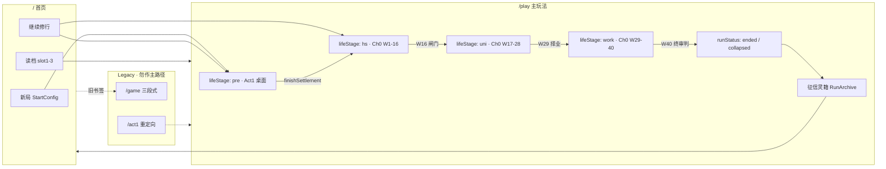

| 路由 | 状态 | 说明 |
|------|------|------|
| `/` | ✅ | 开局、继续、槽位 |
| `/play` | ✅ Ch0 + Act1 | `runMode: chapter` 默认；`useChapterSession` + `resolvePlayScreen` |
| `/game` | Legacy | 日槽 `act(actionId)`，见 [附录 A](#附录-a-legacy-game-日槽决策树) |
| `/act1` `/profile` | 重定向 | → `/play` 或 `/` |

---

## 2. Act1 入学前夜（S0 · 已实现）

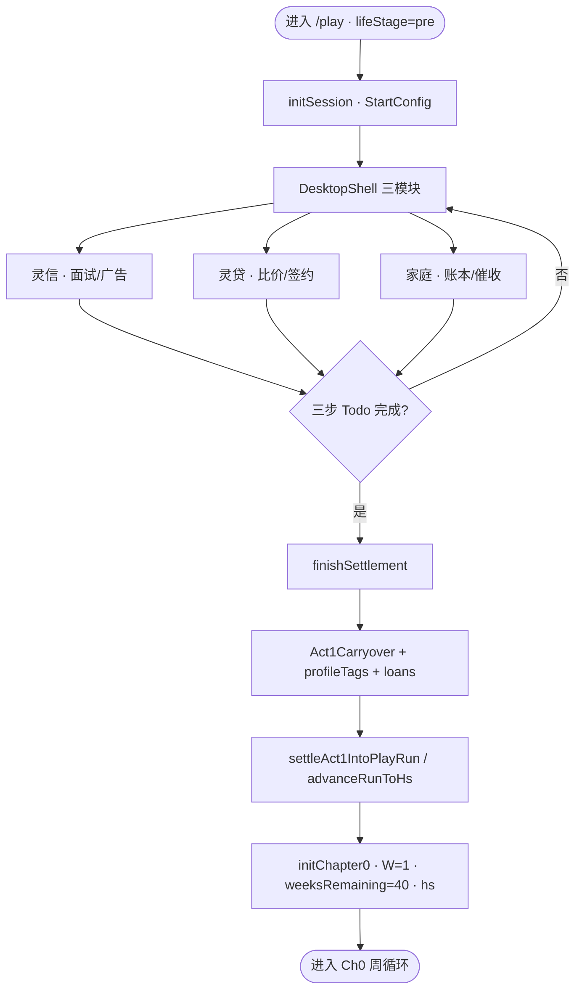

**结转写入**（详见 REDESIGN §4.1.3）：`econ` 账本、`profileTags`、`dailyRate` 乘数、`delinquency` 偏置、`familyOutcome` 来文权重。

---

## 3. Ch0 主循环（v4 目标 · R1～R3）

每周 **1 次**「确认本周」，非 4 选 2 抽牌。

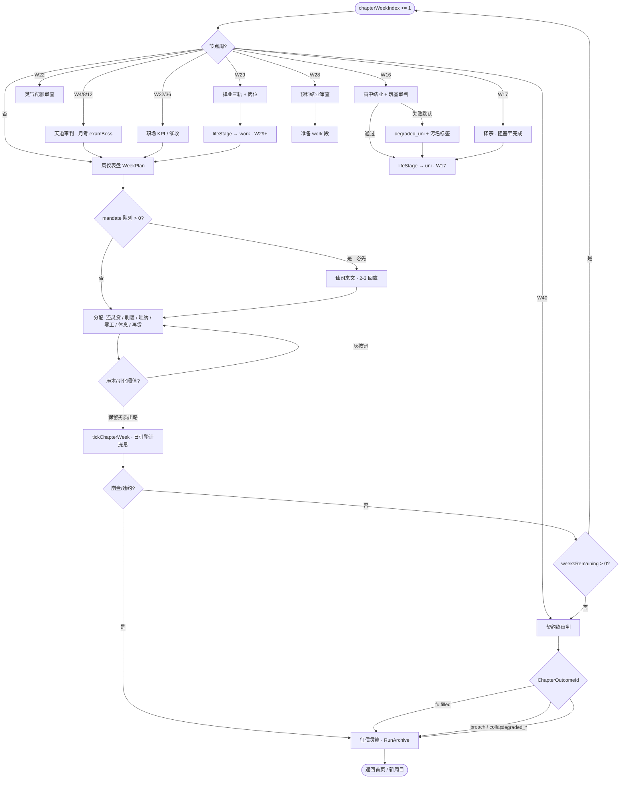

### 3.1 周仪表盘动作（REDESIGN §3.3）

| 动作 | 段 | 备注 |
|------|-----|------|
| `repay` | 全段 | min / partial / extra |
| `study` | hs · uni | 灵籍分 |
| `tuna` | 全段 | 法力 / 破境进度 |
| `parttime` | hs · gig | 波动日结 |
| `work` | work | 主业 KPI |
| `rest` | 全段 | 麻木高时几乎不加专注 |
| `borrow` | 全段 | 以贷养贷 · 驯化↑ |
| `inbox` | 有队列 | 清 mandate，拖后下周+ |

**非节点周**：可「沿用上周分配」一键过周（OQ-4）。

### 3.2 段落与契约周（单一真相）

```mermaid
gantt
  title Ch0 四十周灵贷契约（账期窗口 · 非真实日历）
  dateFormat X
  axisFormat %s

  section hs 高中
  W1-16           :0, 16
  section uni 大学
  W17-28          :16, 28
  section work 职场
  W29-40          :28, 40
```

`chapterWeekIndex` 1..40；`weeksRemaining = 40 - index`；`school.week` 与之同步。

---

## 4. 屏幕栈与 PlayScreenId（解析优先级）

> 实现目标：`resolvePlayScreen(run): PlayScreenId`（[I2-play-director/SCHEMA.md](./planning/I2-play-director/SCHEMA.md)）。  
> v4 新增屏以 **粗体** 标注；endless-* 标 legacy。

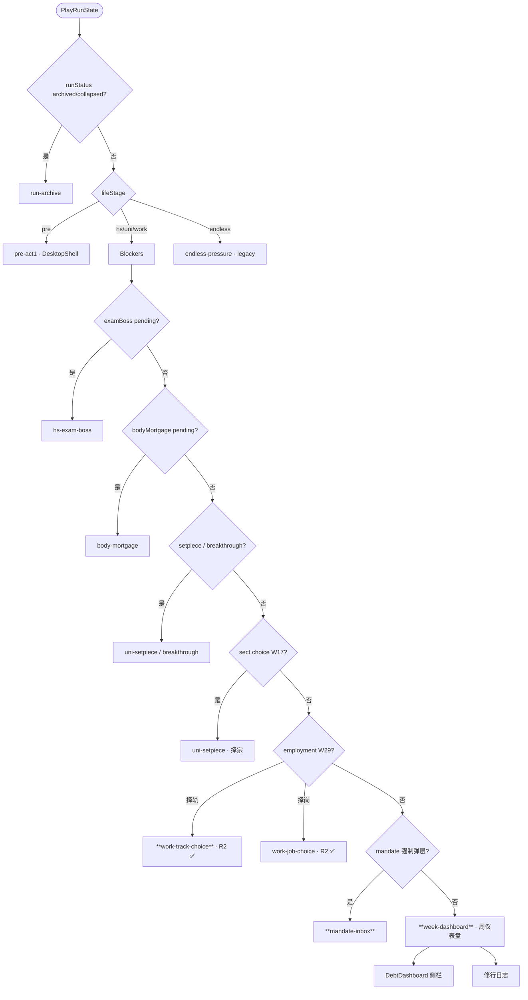

| 优先级 | PlayScreenId | v4 |
|--------|--------------|-----|
| 1 | `run-archive` | ✅ |
| 2 | `pre-act1` | ✅ |
| 3 | `*-exam-boss` / `body-mortgage` / setpiece | ✅ 复用 |
| 4 | `work-track-choice` / `work-job-choice` | ✅ R2 |
| 5 | **`mandate-inbox`** | ✅ R3 |
| 6 | **`week-dashboard`** + WeekPlanPanel | ✅ R2 |
| — | `endless-pressure` | Legacy |

---

## 5. 仙司来文子流程（mandateDelivery · R3）

取代主路径 `pressureDeck` 4 选 2。

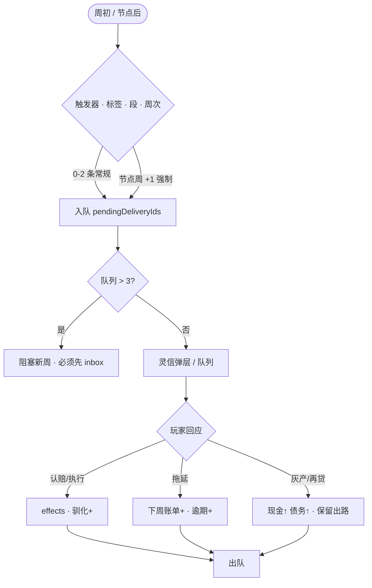

家庭线来文权重：`familyOutcome` = `left` / `saved-costly` / `saved-false-hope`（REDESIGN §4.1.4）。

---

## 6. 段落闸门（禁止静默换段）

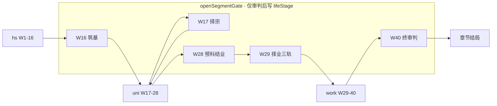

**禁止**：`advanceLifeSegment()` 无 setpiece 直接改 `lifeStage`（v3 反模式）。

---

## 7. 章节结局（征信灵籍）

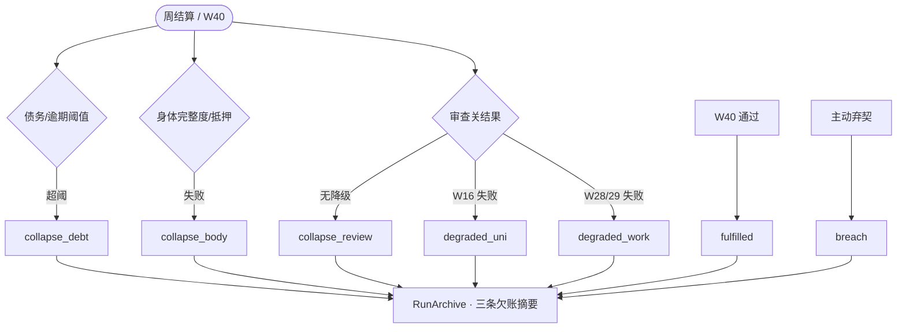

---

## 8. 经济与 PSY（Ch0 复用 + 加强）

### 8.1 还款优先级（logic 已有 · UI 周屏）

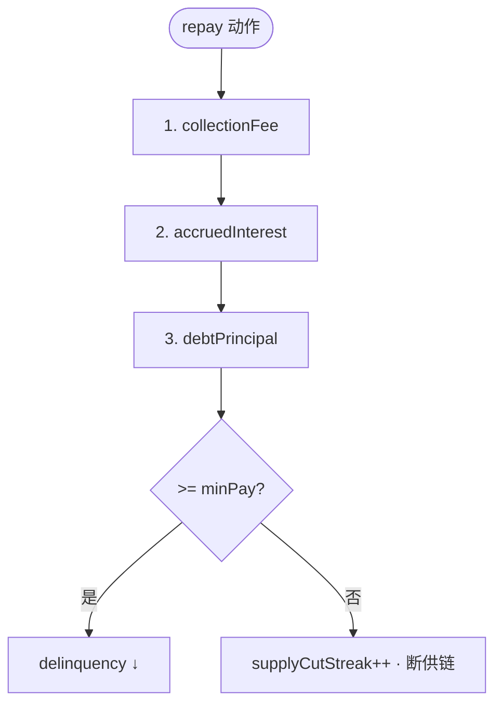

### 8.2 PSY 与仪表盘（v4 主路径）

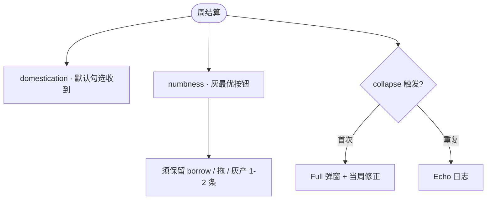

---

## 9. 实现对照（读图时必看）

| 模块 | 文件 | 现状 | v4 |
|------|------|------|-----|
| Act1 | `useAct1Session`, `s0Flow` | ✅ | 保留 |
| 结转 | `createHsPlayState`, `act1Carryover` | ✅ | + `initChapter0` |
| 周推进 | `playDayCycle` | ✅ 日引擎 | + `chapterWeekFlow` |
| 压力牌 | `pressureDeck`, `PressureDeck.vue` | ✅ 4选2 主路径 | → `mandateDelivery` |
| 审判 | `setpieceFlow`, `examBoss` | ✅ | 升格为节点脊梁 |
| 择宗/求职 | `uniFlow`, `workFlow` | ✅ | W17/W29 闸门 |
| 无尽 | `usePlayEndlessSession`, `endlessFlow` | ✅ legacy 主路径 | 废弃 |
| 导演 | `play/index.vue` v-else-if | ✅ | → `resolvePlayScreen` |

---

## 10. 配置驱动架构（扩展 · 勿写死）

章节形状由 **`ChapterConfig`** 描述；Ch0 仅为 `ch0-forty-week-contract` 实例。

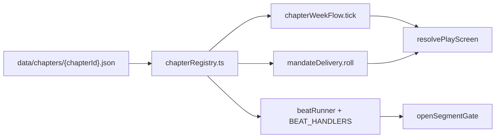

| 改什么 | 改哪里 | 不改哪里 |
|--------|--------|----------|
| 周数 / 段落边界 | config `segments` | `tickChapterWeek` 签名 |
| 新节点周 | config `beats` + handler 注册 | Vue 组件 |
| 新来文 | `data/mandates/*.json` | 主循环 |
| 新一章 Ch1 | 新 json + flow spec | 复制 weekFlow 文件 |

详 [EXTENSIBILITY.md](./planning/R-chapter-0/EXTENSIBILITY.md) · 示例 [chapter-config.example.json](./planning/R-chapter-0/chapter-config.example.json)

---

## 附录 A. Legacy `/game` 日槽决策树

> 仅 `/game` 使用 `act(actionId)`；**Ch0 主路径不经过此树**。

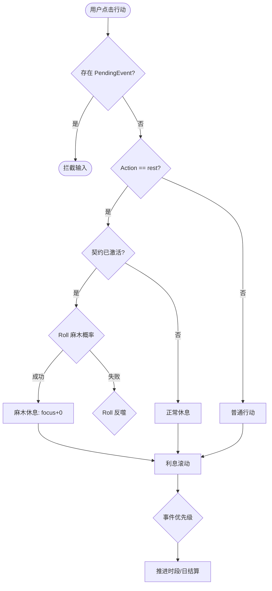

---

## 附录 B. 修订记录

| 日期 | 说明 |
|------|------|
| 2026-05-31 | **v4.4**：§10 配置驱动架构；EXTENSIBILITY / ChapterConfig |
| 2026-05-31 | **v4.3**：重写主路径 `/play` + Ch0 四十周；Act1/闸门/来文/结局；Legacy `/game` 下沉附录 |
| （更早） | 原稿：仅 `/game` + `act()` 决策树 |
