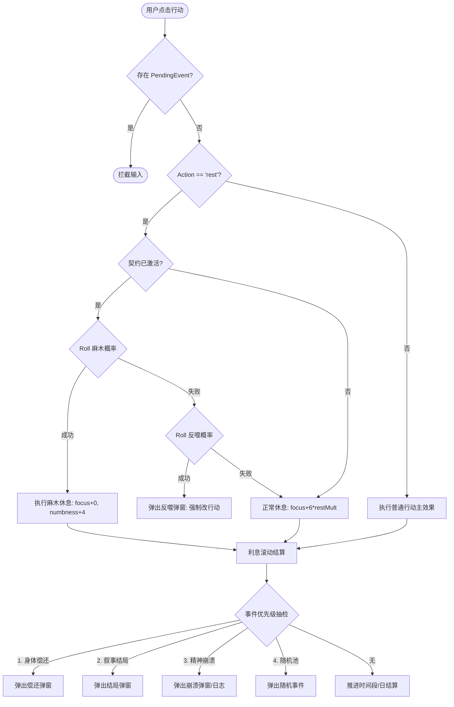
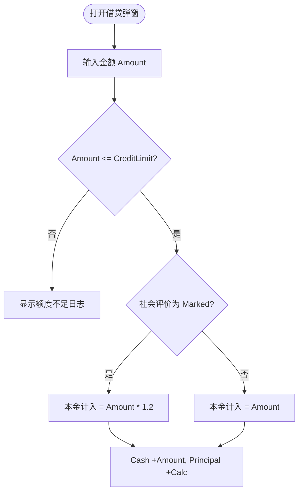
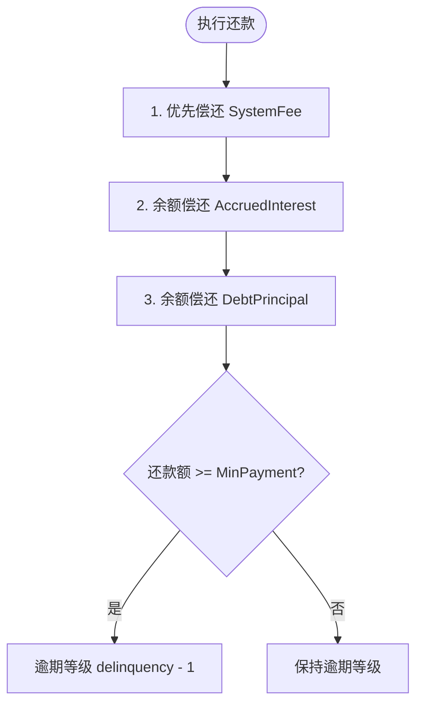
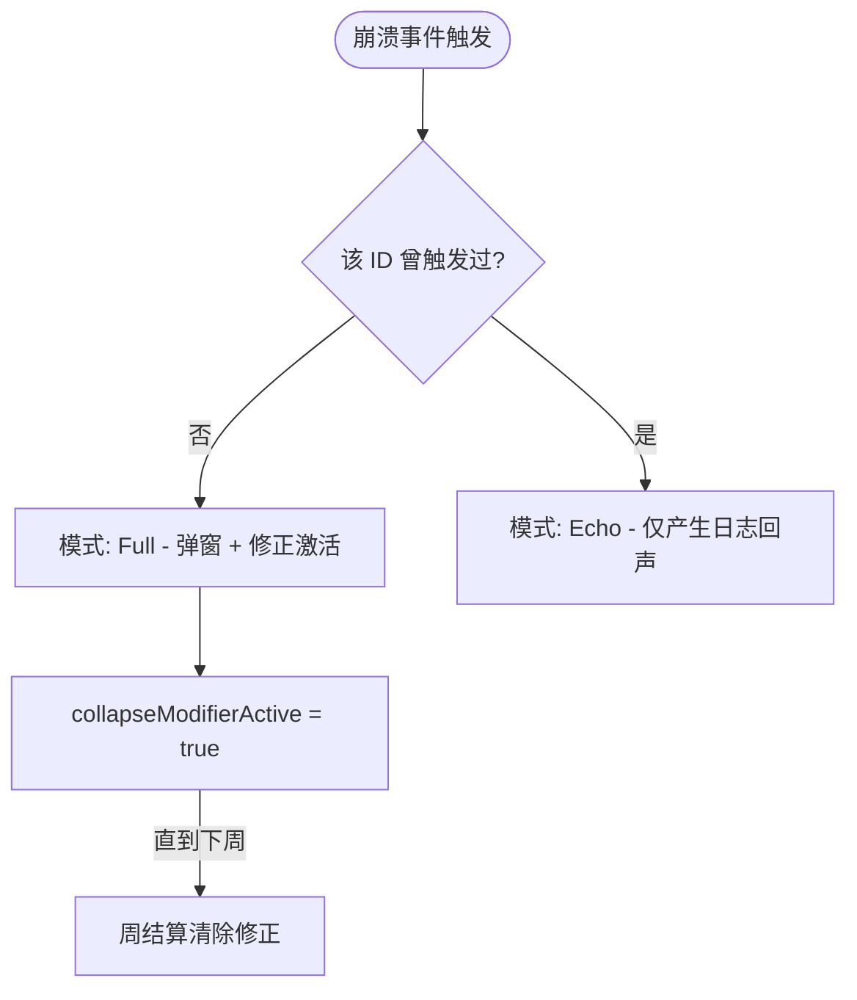
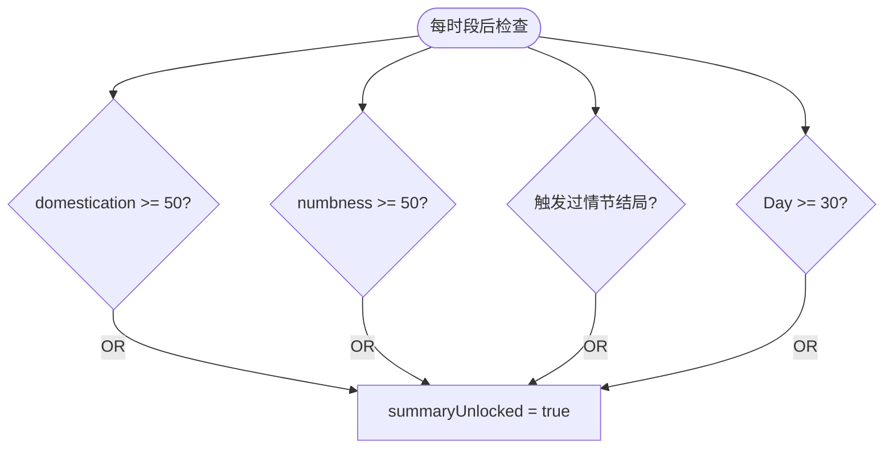

# 修仙欠费中：交互深度流程图

本文档描述项目的核心交互逻辑，使用 Mermaid 语法展现状态迁移与业务决策树。

---

## 1. 顶层页面导航 (Top-level Navigation)

```mermaid
graph LR
  Index[/index] -- startNew --> Game[/game]
  Index -- loadSlot --> Game
  Game -- reset --> Index
  Game -- openDev --> Dev[/dev/*]
```

---

## 2. 核心行动决策树 (Action Decision Tree)

每次调用 `act(actionId)` 时的逻辑分流：



---

## 3. 借贷与还款子流程 (Economy Sub-flows)

### 3.1 借贷 (Borrow)


### 3.2 还款 (Repay)
还款遵循严格的 **「优先级扣除顺序」**：


---

## 4. 精神崩溃与总结解锁 (PSY & Summary)

### 4.1 崩溃呈现逻辑


### 4.2 总结面板解锁

